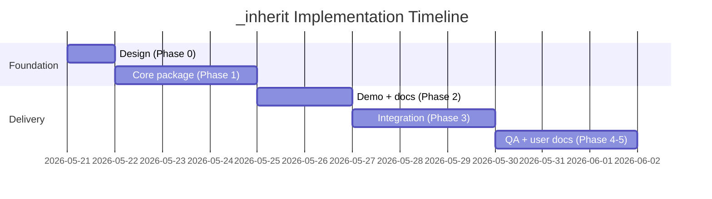

# Horilla CRM — `_inherit` Model Extension Migration Plan

> **Version:** 1.3
> **Status:** Implemented (core package)
> **Scope:** Port the Horilla HRMS `_inherit` feature into Horilla CRM
> **Target package:** `horilla/extension/`

---

## Table of contents

1. [Executive summary](#1-executive-summary)
2. [Feature overview](#2-feature-overview)
3. [Architecture](#3-architecture)
4. [Package layout](#4-package-layout)
5. [Current state](#5-current-state)
6. [Design decisions](#6-design-decisions)
7. [Developer rules](#7-developer-rules)
8. [CRM integrations](#8-crm-integrations)
9. [Implementation phases](#9-implementation-phases)
10. [Timeline & resources](#10-timeline--resources)
11. [Risks & limitations](#11-risks--limitations)
12. [Success criteria](#12-success-criteria)
13. [Appendices](#13-appendices)

---

## 1. Executive summary

### Objective

Build a native **`_inherit` model extension system** for Horilla CRM so third-party and in-house apps can add columns and methods to existing CRM models **without**:

- Creating new database tables for extension classes
- Modifying upstream migration folders (`horilla_crm/*/migrations/`, `horilla/contrib/*/migrations/`)

### Outcome

| Goal | How `_inherit` delivers it |
|------|----------------------------|
| Modular customization | Extension apps own their migrations and code |
| Upgrade safety | Core CRM `git pull` never conflicts with extension migrations |
| Native ORM/forms | Injected fields behave like first-class model fields |
| Clean removal | Documented migrate / uninstall workflow |

### Recommendations

1. Implement all machinery under a single package: **`horilla/extension/`**.
2. Attach the extension **metaclass** to `HorillaCoreModel` (same pattern as HRMS `HorillaModel` + `HorillaModelBase`) — see [§6.1](#61-metaclass-on-horillacoremodel--chosen-approach).

---

## 2. Feature overview

### 2.1 What it does

A custom app subclasses **`HorillaCoreModel`** and sets `_inherit` to add fields to an existing model’s table (same pattern as HRMS `HorillaModel`):

```python
# my_lead_extensions/models.py
from django.core.exceptions import ValidationError

from horilla.db import models
from horilla.contrib.core.models import HorillaCoreModel
from horilla.utils.translation import gettext_lazy as _


class LeadExtension(HorillaCoreModel):
    _inherit = "leads.Lead"

    industry_code = models.CharField(
        max_length=20,
        null=True,
        blank=True,
        verbose_name=_("Industry Code"),
    )

    def clean(self):
        if self.industry_code and len(self.industry_code) < 3:
            raise ValidationError(
                {"industry_code": _("Must be at least 3 characters.")}
            )
```

### 2.2 Expected behavior

| Area | Result |
|------|--------|
| **Database** | `industry_code` column added to `leads_lead` |
| **Extension table** | **Not** created — `my_lead_extensions_leadextension` does not exist |
| **Forms** | `HorillaModelForm(fields="__all__")` includes injected fields |
| **Validation** | Target `clean()` runs first, then extension `clean()` |
| **Migrations** | `InjectField` ops written only in the extension app |
| **Core migrations** | `leads/migrations/` remains untouched |
| **Removal** | See [§7.4 Removal strategy](#74-removal-strategy) |

### 2.3 `_inherit` vs `additional_info`

| Approach | Best for | Limitations |
|----------|----------|-------------|
| **`additional_info` JSON** (`HorillaCoreModel`) | Ad-hoc, temporary metadata | Weak search/filter/export; no per-field permissions |
| **`_inherit` extensions** | Stable, typed, reportable fields | Requires extension app + migrations |

Use **`_inherit`** when fields need validation, permissions, export, or querying. Use **`additional_info`** for loose metadata only.

---

## 3. Architecture

### 3.1 High-level flow

```text
Extension app defines HorillaCoreModel subclass + _inherit
                    │
                    ▼
┌───────────────────────────────────────────────────────────┐
│  Runtime (ExtensionModelBase on HorillaCoreModel)  │
│  • Extract fields + methods                               │
│  • Register INJECTION_MAP                                 │
│  • lazy_model_operation → contribute_to_class(target)     │
│  • Return placeholder class (no Django model / no table)  │
└───────────────────────────────────────────────────────────┘
                    │
                    ▼
┌───────────────────────────────────────────────────────────┐
│  Migrations (HorillaAutodetector + InjectField)           │
│  • makemigrations detects new columns on target model     │
│  • Routes AddField → extension app migration file         │
│  • DDL runs on target table (e.g. leads_lead)             │
└───────────────────────────────────────────────────────────┘
```

### 3.2 Runtime injection

The metaclass `ExtensionModelBase` lives in `horilla/extension/`. It is **wired onto** `HorillaCoreModel`:

```python
# horilla/contrib/core/models/base.py
from horilla.extension import ExtensionModelBase

class HorillaCoreModel(models.Model, metaclass=ExtensionModelBase):
    class Meta:
        abstract = True
    # ... company, audit fields, etc.
```

When a class is defined:

| Class definition | Metaclass behavior |
|------------------|-------------------|
| `class Lead(HorillaCoreModel):` — no `_inherit` | Normal Django model creation (`super().__new__`) |
| `class LeadExtension(HorillaCoreModel): _inherit = "leads.Lead"` | Injection path (steps below) |

**Injection path** (only when `_inherit` is in the class namespace):

1. Detects `_inherit = "app_label.ModelName"`
2. Extracts `models.Field` instances and callable methods from the class body
3. Registers ownership in `INJECTION_MAP`
4. Schedules `contribute_to_class` on the target via `apps.lazy_model_operation(_apply, (app_label, model_name.lower()))` — Django’s pending-operation key is `(app_label, model._meta.model_name)` (always **lowercase**). Using `Lead` instead of `lead` leaves the operation pending and triggers **models.E022** at system check.
5. Returns a **placeholder** `type(name, (object,), {...})` — not a Django model

After injection, `Lead._meta.get_fields()` includes extension fields as if they were defined on `Lead`.

> **Note:** Extension classes still *syntax* subclass `HorillaCoreModel`, but the metaclass **does not** create a table for them when `_inherit` is set. No `company` / audit columns are added to a separate extension table.

### 3.3 Migration routing

`HorillaAutodetector` (in `horilla/extension/autodetect.py`):

1. **New columns** — overrides `_generate_added_field`, looks up `INJECTION_MAP`, emits **`InjectField`** in the **extension app** (host app migrations stay untouched).
2. **Changes to existing injected columns** — Django’s `generate_altered_fields()` emits **`AlterField`** with `add_operation(leads, …)`. **`add_operation` is overridden** to rewrite those to **`AlterInjectedField`** in the extension app when `INJECTION_MAP` owns the field. Same idea for **`RemoveField`** → **`RemoveInjectedField`**.

Without (2), the first migration lands in the extension app, but a later edit (e.g. `verbose_name`) would produce **`0003_alter_lead_*` under `leads`** because Django routes alterations to the model’s **declared** app label.

### 3.4 Why `INJECTION_MAP` exists

Storing ownership on the field (e.g. `field._injected_by = "my_app"`) **does not work** for migrations.

During `makemigrations`, Django rebuilds fields in `ProjectState` via `field.deconstruct()`, which **strips custom runtime attributes** before the autodetector runs.

Therefore ownership lives in a plain dict with no Django dependencies:

```python
# horilla/extension/registry.py
INJECTION_MAP[(app_label, model_name, field_name)] = extension_app_label
```

This survives the full migration lifecycle and lets `HorillaAutodetector` route operations correctly.

### 3.5 Why extension models do not create tables

When `_inherit` is set, the metaclass does **not** return a `ModelBase` subclass. It returns a lightweight placeholder:

```python
type(name, (object,), {"_is_horilla_extension": True, ...})
```

Django never registers a table for the extension class. Fields and methods are injected into the **target** model only.

### 3.6 Django APIs used

| API | Purpose |
|-----|---------|
| `ModelBase.__new__` | Custom metaclass hook |
| `apps.lazy_model_operation(fn, (app, model))` | Defer injection until target is registered |
| `field.contribute_to_class(model, name)` | Attach field to target `_meta` |
| `MigrationAutodetector._generate_added_field` | Route migrations to extension app |
| `OperationDependency` | Cross-app migration dependencies (Django 6.x) |

---

## 4. Package layout

### 4.1 Directory structure

All `_inherit` code lives in **one** subpackage:

```text
horilla/
├── __init__.py                 # do not import horilla.extension here (see §4.5)
└── extension/
    ├── __init__.py             # re-exports model API + autodetector patch
    ├── models/
    │   ├── registry.py         # INJECTION_MAP
    │   ├── migration_ops.py    # InjectField
    │   ├── autodetect.py       # HorillaAutodetector
    │   └── metaclass.py        # ExtensionModelBase (metaclass only)
    └── forms/                  # _inherit_form (see forms/inherit.md)
        ├── registry.py
        ├── metaclass.py
        ├── compose.py
        ├── resolve.py
        └── bootstrap.py
```

`HorillaCoreModel` in `horilla/contrib/core/models/base.py` is updated to use `metaclass=ExtensionModelBase`.

### 4.2 Folder name rationale

| Candidate | Verdict |
|-----------|---------|
| **`horilla/extension/`** | **Chosen** — houses metaclass, registry, migrations; wired into `HorillaCoreModel` |
| `horilla/inherit/` | Too tied to `_inherit` syntax; confused with Python inheritance |
| `horilla/model_extension/` | Accurate but verbose |
| `horilla/extensions/` | Plural suggests unrelated plugins |

### 4.3 Module responsibilities

| Module | Responsibility |
|--------|----------------|
| `models/registry.py` | `INJECTION_MAP` — no Django imports |
| `models/migration_ops.py` | `InjectField` custom operation (DDL on target, state in extension app) |
| `models/autodetect.py` | `HorillaAutodetector` |
| `models/metaclass.py` | `ExtensionModelBase`, `EXTENSION_REGISTRY` |
| `extension/__init__.py` | Re-exports model API; patches `makemigrations` / `migrate` autodetector |
| `forms/*` | `_inherit_form` registry, composition, `resolve_form_class()` |
| `contrib/core/models/base.py` | `HorillaCoreModel(..., metaclass=ExtensionModelBase)` |

### 4.4 Public API

```python
# Standard usage — extensions use the same base as all CRM models
from horilla.contrib.core.models import HorillaCoreModel

class LeadExtension(HorillaCoreModel):
    _inherit = "leads.Lead"
    ...

# Advanced / internal
from horilla.extension import (
    ExtensionModelBase,
    INJECTION_MAP,
    EXTENSION_REGISTRY,
    InjectField,
    HorillaAutodetector,
)
```

### 4.5 Bootstrap

Do **not** import `horilla.extension` from `horilla/__init__.py`: loading settings imports the `horilla` package before Django finishes `apps.populate()`, and importing `horilla.db` would raise `AppRegistryNotReady`.

Instead, **`CoreConfig.ready()`** (`horilla/contrib/core/apps.py`) imports `horilla.extension`, which patches `makemigrations` / `migrate`.

The metaclass module (`horilla/extension/models/metaclass.py`) uses Django’s `Field` base only — not `from horilla.db import models` — so `HorillaCoreModel` can load during app registry population without triggering that cycle.

```python
# horilla/contrib/core/apps.py — CoreConfig.ready()
def ready(self):
    import horilla.extension  # noqa: F401 — registers HorillaAutodetector
    super().ready()
```

### 4.6 HR → CRM file mapping

| Horilla HRMS (flat) | Horilla CRM |
|---------------------|-------------|
| `horilla/extension_registry.py` | `horilla/extension/models/registry.py` |
| `horilla/migration_ops.py` | `horilla/extension/models/migration_ops.py` |
| `horilla/autodetect.py` | `horilla/extension/models/autodetect.py` |
| Metaclass on `HorillaModel` in `horilla/models.py` | `horilla/extension/models/metaclass.py` + applied to `HorillaCoreModel` in `base.py` |
| Patch | `CoreConfig.ready()` imports `horilla.extension` |
| Metaclass import | `horilla/extension/models/metaclass.py` uses Django `Field` only (no `horilla.db` at import time) |

---

## 5. Current state

### 5.1 Horilla CRM (target)

| Item | Status |
|------|--------|
| `horilla/extension/` package | **Not implemented** |
| `_inherit` / `INJECTION_MAP` / `InjectField` | **Not present** |
| Base business model | `HorillaCoreModel` (`horilla/contrib/core/models/base.py`) |
| Model imports | `from horilla.db import models` (required) |
| Transactions / connection | `from horilla.db import transaction`, `connection` (required in app code; re-exported in `horilla/db/__init__.py`) |
| App bootstrap | `AppLauncher` + `auto_import_modules` |
| Django version | **6.0** (`requirements.txt`) |
| Forms | `HorillaModelForm` / `HorillaMultiStepForm` |
| Permissions | 4-layer (model, field, row, role) |

### 5.2 HR vs CRM mapping

| Horilla HRMS | Horilla CRM |
|--------------|-------------|
| `HorillaModel` | `HorillaCoreModel` (abstract) |
| `from horilla.models import HorillaModel` | `from horilla.contrib.core.models import HorillaCoreModel` |
| `from django.db import models` | `from horilla.db import models` |
| `from django.db import transaction` | `from horilla.db import transaction` |
| `from django.db import connection` | `from horilla.db import connection` |
| `_inherit = "employee.Employee"` | `_inherit = "leads.Lead"` |
| Metaclass on `HorillaModel` | Metaclass on `HorillaCoreModel` — **same pattern** |

---

## 6. Design decisions

### 6.1 Metaclass on `HorillaCoreModel` — chosen approach

**Yes — this is correct**, and it matches how Horilla HRMS implements the feature.

Apply the **metaclass** (not the model class) to `HorillaCoreModel`:

```python
# ✅ Correct
from horilla.extension import ExtensionModelBase

class HorillaCoreModel(models.Model, metaclass=ExtensionModelBase):
    class Meta:
        abstract = True
```

```python
# ❌ Incorrect — HorillaCoreModel is a model class, not a metaclass (TypeError / wrong behavior)
class HorillaCoreModel(models.Model, metaclass=HorillaCoreModel):
    ...
```

| Question | Answer |
|----------|--------|
| Is `metaclass=` on `HorillaCoreModel` correct? | **Yes** — same as HR `HorillaModel` + `HorillaModelBase` |
| Do normal CRM models break? | **No** — metaclass only intercepts when `_inherit` is in the class namespace |
| Do extensions use a separate base? | **No** — they use **`HorillaCoreModel`** plus `_inherit` |
| Performance concern? | Negligible — one extra `__new__` branch per class definition at import time |

**Why not a separate extension-only subclass of `HorillaCoreModel`?**

| Separate base (v1.2 draft) | Metaclass on `HorillaCoreModel` (v1.3 — chosen) |
|------------------------------|--------------------------------------------------|
| Two bases to learn | One base for all Horilla models |
| Diverges from HRMS | **Identical to HRMS** — easier port and docs |
| Implied extensions are “different” kind of model | Extensions are `HorillaCoreModel` declarations with `_inherit` |

**Import rule:** `horilla/extension/metaclass.py` must **not** import `HorillaCoreModel` (avoid circular imports). Only `base.py` imports the metaclass.

### 6.2 Decision table

| # | Decision | Rationale |
|---|----------|-----------|
| 1 | Single package `horilla/extension/` | Registry, ops, autodetector, metaclass in one place |
| 2 | `ExtensionModelBase` on `HorillaCoreModel` | HRMS-aligned; one base class for apps |
| 3 | No alias for `_inherit` classes | **`HorillaCoreModel` only** — avoids an extra export with no behavioral difference |
| 4 | `_inherit = "app_label.ModelName"` | Django app labels (`leads`, `contacts`) — not module paths |
| 5 | App label via `get_containing_app_config(__module__)` | Correct for `horilla_crm.*` packages |
| 6 | `INJECTION_MAP` dict (not field attributes) | Survives `deconstruct()` / `ProjectState` |
| 7 | Placeholder class when `_inherit` set | No extension table created |
| 8 | **Hard removal** by default (Phase 1) | `migrate extension_app zero` drops columns — see §7.4 |

---

## 7. Developer rules

### 7.1 Extension app ordering

Extension apps **must load after** the apps they extend:

```python
# settings — conceptual order
INSTALLED_APPS = [
    # ... core + horilla_crm apps ...
    "horilla_crm.leads",
    "horilla_crm.contacts",
    # Extensions AFTER targets
    "my_lead_extensions",
]
```

Target models must be registered before `lazy_model_operation` runs.

### 7.2 `clean()` chaining rules

When defining `clean()` on an extension class:

| Do | Don't |
|----|-------|
| Raise `ValidationError` for invalid data | Call `super().clean()` |
| Use `self.<field>` for values | Return a value from `clean()` |

The system chains the target model’s `clean()` **before** the extension `clean()`. Calling `super().clean()` would double-run the target validator.

```python
def clean(self):
    if self.industry_code == "XX":
        raise ValidationError({"industry_code": _("Invalid code.")})
```

### 7.3 Model `clean()` vs form `clean_<field>()`

| | Model `clean()` | Form `clean_<field>()` |
|---|-----------------|------------------------|
| Return | Nothing | Must return the field value |
| Data | `self.<field>` | `self.cleaned_data["field"]` |
| `super()` | Do not call on extensions | Call `super()` as usual |
| When runs | `full_clean()`, `form.is_valid()` | `form.is_valid()` only |

### 7.4 Removal strategy

**Phase 1 — Hard removal (planned default)**

```bash
python manage.py migrate my_lead_extensions zero
```

- Runs `InjectField.database_backwards` → **drops columns** from the target table
- Then remove app from `INSTALLED_APPS` and delete the app directory
- Core CRM migrations were never modified — nothing to revert upstream

**Future option — Soft removal (out of scope for v1)**

- Uninstalling the app hides fields at ORM level but **preserves DB columns**
- Re-install restores access without data loss
- Requires additional design; not in initial implementation

### 7.5 Extending multiple models from one app

```python
class LeadExtension(HorillaCoreModel):
    _inherit = "leads.Lead"
    industry_code = models.CharField(max_length=20, null=True, blank=True)


class ContactExtension(HorillaCoreModel):
    _inherit = "contacts.Contact"
    linkedin_url = models.URLField(null=True, blank=True)
```

`makemigrations` produces one migration in the extension app with all `InjectField` operations.

### 7.6 Upgrade-safe Git workflow

```text
horilla-crm/                          ← upstream repo
  horilla_crm/leads/migrations/       ← NEVER touched by extensions

my_lead_extensions/                   ← your private repo
  migrations/
    0001_initial.py                   ← InjectField operations only
```

Pulling upstream CRM updates does not conflict with extension migrations because extensions never write into `horilla_crm/*/migrations/`.

---

## 8. CRM integrations

### 8.1 Expected to work (Phase 1–2)

| Subsystem | Expectation |
|-----------|-------------|
| ORM / `_meta` | Injected fields on target model |
| `HorillaModelForm` (`fields="__all__"`) | Auto-includes injected fields |
| Validation | Chained `clean()` + field validators |
| HTMX forms | Transparent if using standard generics |
| Audit log | Changes to injected fields tracked on target |
| Multi-company | `CompanyFilteredManager` unchanged — same table |
| Import/export | Real DB columns (verify field lists in exporter) |

### 8.2 Requires explicit work (Phase 3)

| Subsystem | Gap | Mitigation |
|-----------|-----|------------|
| **HorillaListView** | Often uses explicit `columns` | Add injected field names to `columns` |
| **Field permissions** | New fields need `FieldPermission` rows | Document admin setup |
| **DRF serializers** | Usually explicit `fields` | Extend serializer or dynamic fields |
| **Global search** | May ignore non-indexed columns | Document indexing if needed |
| **Duplicates / cadences inject** | Monkey-patches generic views | Regression-test detail tabs |

### 8.3 Out of scope (v1)

- Extending `Company` (not `HorillaCoreModel`)
- Proxy / swappable / unmanaged / abstract-only targets
- Auto DRF serializer generation
- Auto list column registration
- Soft removal (ORM hide, keep columns)

---

## 9. Implementation phases

### Phase 0 — Design (0.5 day)

- [ ] Confirm package layout `horilla/extension/`
- [ ] Confirm hard removal behavior
- [ ] Validate CRM `app_label` values (`leads`, `contacts`, …)

### Phase 1 — Core mechanism (2–3 days)

| # | File | Deliverable |
|---|------|-------------|
| 1 | `horilla/extension/registry.py` | `INJECTION_MAP` |
| 2 | `horilla/extension/migration_ops.py` | `InjectField` (Django 6.x) |
| 3 | `horilla/extension/autodetect.py` | `HorillaAutodetector` |
| 4 | `horilla/extension/metaclass.py` | `ExtensionModelBase`, `EXTENSION_REGISTRY` |
| 5 | `horilla/extension/__init__.py` | Public API + autodetector patch |
| 6 | `horilla/contrib/core/models/base.py` | `HorillaCoreModel(..., metaclass=ExtensionModelBase)` |
| 7 | `horilla/contrib/core/models/__init__.py` | Re-export core models (`HorillaCoreModel`, etc.) |
| 8 | `horilla/contrib/core/apps.py` | `CoreConfig.ready()` imports `horilla.extension` |

**Metaclass notes:**

- Detect fields with `isinstance(v, Field)` using Django’s `django.db.models.fields.Field` at import time (do **not** import `horilla.db` in `metaclass.py` — it triggers `AppRegistryNotReady` during settings load).
- Resolve extension app: `django_apps.get_containing_app_config(__module__).label` (with `AppRegistryNotReady` fallback).

### Phase 2 — Demo app & docs (1–2 days)

- [ ] `horilla_crm_extensions_demo` (or `testapp`) with `LeadExtension`
- [ ] `AppLauncher` + `auto_import_modules = ["models"]`
- [ ] Verify `makemigrations` / `migrate` / `migrate … zero`
- [ ] `docs/horilla/extension/models/inherit.md` — model `_inherit` guide
- [ ] `docs/horilla/extension/forms/inherit.md` — form `_inherit_form` guide

### Phase 3 — Integration hardening (2–3 days)

- [ ] Permissions + field visibility
- [ ] DRF serializer example
- [ ] Import/export with injected column
- [ ] Multiple extensions on one model
- [ ] `clean()` chain with existing `Lead.clean`

### Phase 4 — Testing & QA (2 days)

| Type | Coverage |
|------|----------|
| Unit | `INJECTION_MAP`, placeholder flags, `clean()` order |
| Migration | `InjectField` forward/backward; no files in `leads/migrations/` |
| Integration | HTMX create/edit; multi-company unchanged |
| Regression | `manage.py check`; existing leads tests |

### Phase 5 — End-user documentation (1 day)

Publish `docs/horilla/extension/models/inherit.md` and `docs/horilla/extension/forms/inherit.md`:

- When to use `_inherit` vs `additional_info`
- Extension app setup (`AppLauncher`, `INSTALLED_APPS` order)
- Migration workflow and safe removal
- Form / list / API / permission notes

---

## 10. Timeline & resources

### 10.1 Timeline

| Phase | Estimate | Owner |
|-------|----------|-------|
| 0 — Design | 0.5 day | Dev |
| 1 — Core mechanism | 2–3 days | Dev |
| 2 — Demo + dev docs | 1–2 days | Dev |
| 3 — CRM hardening | 2–3 days | Dev |
| 4 — QA | 2 days | QA / Dev |
| 5 — User docs | 1 day | Dev / Tech writer |
| **Total** | **8–12 days** | 1 developer FTE |



### 10.2 Resources

| Resource | Purpose |
|----------|---------|
| HRMS reference commit | Source for registry, ops, autodetect, metaclass |
| Django 6.0 documentation | `OperationDependency`, autodetector API |
| PostgreSQL dev DB | Primary `InjectField` DDL testing |
| SQLite (`dbtest.sqlite3`) | Fast local migration tests |
| Generics/forms expertise | Form and list view integration |
| MCP CRM codebase search | Validate `app_label` names |

### 10.3 File checklist

| File | Action |
|------|--------|
| `horilla/extension/__init__.py` | Create |
| `horilla/extension/registry.py` | Create |
| `horilla/extension/migration_ops.py` | Create |
| `horilla/extension/autodetect.py` | Create |
| `horilla/extension/metaclass.py` | Create |
| `horilla/contrib/core/models/base.py` | Update — add `metaclass=ExtensionModelBase` |
| `horilla/contrib/core/models/__init__.py` | Update — keep public exports aligned with `base.py` |
| `horilla/contrib/core/apps.py` | Update — `CoreConfig.ready()` imports `horilla.extension` |
| `docs/horilla/extension/models/inherit.md` | Create — extension overview + model `_inherit` |
| `docs/horilla/extension/forms/inherit.md` | Create — form `_inherit_form` |
| `horilla_crm_extensions_demo/` | Optional reference app |

---

## 11. Risks & limitations

### 11.1 Risk register

| Risk | Impact | Mitigation |
|------|--------|------------|
| Wrong `app_label` in `_inherit` | Injection fails silently | Metaclass validation + clear error message |
| Extension before target in `INSTALLED_APPS` | Fields not injected | Document ordering; optional startup check |
| List/API ignore injected fields | Feature appears broken | Phase 3 examples + user docs |
| Field permissions hide new fields | Forms look empty | Admin guide for `FieldPermission` |
| HR/CRM port drift | Bugs on merge | Track HR commit SHA; single port PR |

### 11.2 Known limitations (v1)

- No proxy / swappable / unmanaged model targets
- No automatic DRF serializer or list column registration
- No extending `Company` or abstract-only models
- Hard removal only (columns dropped on `migrate … zero`)
- Manual list `columns` / serializer `fields` configuration

---

## 12. Success criteria

- [ ] `horilla/extension/` package implemented (`registry`, `migration_ops`, `autodetect`, `metaclass`, `__init__`)
- [ ] `HorillaCoreModel` uses `metaclass=ExtensionModelBase`
- [ ] `makemigrations` writes `InjectField` only in extension app migrations
- [ ] `horilla_crm/leads/migrations/` unchanged after installing an extension
- [ ] Injected columns exist in DB and on `Lead._meta.get_fields()`
- [ ] `HorillaModelForm(fields="__all__")` renders and validates injected fields
- [ ] `migrate <extension_app> zero` drops columns cleanly
- [ ] `python manage.py check` passes
- [ ] `docs/horilla/extension/models/inherit.md` and `forms/inherit.md` published
- [ ] No duplicate implementation at `horilla/` package root

---

## 13. Appendices

### Appendix A — Example extension app

```text
my_lead_extensions/
├── apps.py
├── models.py
├── migrations/
│   └── 0001_initial.py    # InjectField operations only
└── registration.py          # Only if app defines its own models
```

```python
# apps.py
from horilla.apps import AppLauncher
from horilla.utils.translation import gettext_lazy as _


class MyLeadExtensionsConfig(AppLauncher):
    default = True
    name = "my_lead_extensions"
    verbose_name = _("Lead Extensions")
    auto_import_modules = ["models"]
```

```python
# models.py
from horilla.db import models
from horilla.contrib.core.models import HorillaCoreModel


class LeadExtension(HorillaCoreModel):
    _inherit = "leads.Lead"

    industry_code = models.CharField(max_length=20, null=True, blank=True)
```

```python
# local_settings.py
INSTALLED_APPS += ["my_lead_extensions"]
```

### Appendix B — Django 6.x compatibility

| Area | Django 6.x API |
|------|----------------|
| Add column | `schema_editor.add_field(model, field)` |
| Remove column | `schema_editor.remove_field(model, field)` |
| Migration dependencies | `OperationDependency(app, model, None, Type.CREATE)` |
| Project state fields | `self.to_state.models[app_label, model_name.lower()].get_field(name)` |
| Autodetector parity | Same class on `makemigrations` and `migrate` commands |

> **Django ≤ 5.x:** Use `add_column` / `remove_column` and tuple dependencies `[(app_label, "__first__")]`. CRM targets Django 6.0.

### Appendix C — Vision

This feature introduces ERP-style, upgrade-safe extensibility for Horilla CRM:

- Third-party extensions without core patches
- Isolated migration ownership per extension app
- Native ORM, forms, and validation for custom fields
- Cleaner enterprise deployments and upstream sync

---

*End of document — Horilla CRM `_inherit` migration plan v1.3*
