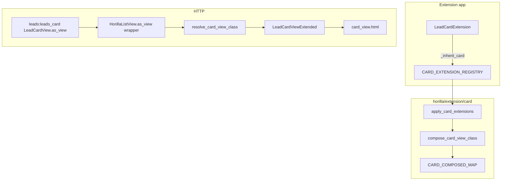

# `_inherit_card` — Technical specification

> **Status:** Implemented (`horilla/extension/card/`)
> **User guide:** [inherit.md](./inherit.md)
> **Index:** [../inherit.md](../inherit.md)

---

## 1. Purpose

Extend existing `HorillaCardView` subclasses (e.g. `LeadCardView`) from extension apps **without** editing `horilla_crm` view modules.

`HorillaCardView` subclasses `HorillaListView` and reuses queryset, filters, and `columns` for `card_view.html` / `card_view_cards.html`. Card layout is separate from the table list URL (`leads:leads_card` vs `leads:leads_list`).

| Problem | Solution |
|---------|----------|
| Card grid uses different `columns` than table list | `_inherit_card` on `LeadCardView` (independent of `_inherit_list` on `LeadListView`) |
| Card-specific flags (`paginate_by`, `bulk_select_option`) | Scalar overrides on extension class |
| Duplicate list extension on card URL | Dedicated registry + `resolve_card_view_class()` |

---

## 2. Registration API

| Attribute | Required | Description |
|-----------|----------|-------------|
| `_inherit_card` | Yes | Dotted path: `"horilla_crm.leads.views.core.LeadCardView"` |
| `_inherit_card_priority` | No | Higher = later mixin. Default `0`. |
| `override_attrs` | No | Reserved for future conflict rules |

### Layout hooks (same semantics as `_inherit_list`)

| Hook | Behavior |
|------|----------|
| `columns_insert` | `[(after_column, new_column), ...]` on card `columns` |
| `columns_append` | Append column keys |
| `actions_append` | Append row/card action dicts |
| `bulk_update_fields_append`, `export_exclude_append`, … | Same as list extension |

### Card-friendly scalar overrides

| Attribute | Default on `HorillaCardView` |
|-----------|------------------------------|
| `paginate_by` | `24` |
| `bulk_select_option` | `False` |
| `table_class` | `False` |
| `table_width` | `False` |
| `enable_quick_filters`, `filterset_class`, `view_id`, … | Same as list |

### Methods

Callable attributes on the extension class become mixins; override `get_queryset`, `col_attrs`, `render_to_response`, etc. with `super()`.

### Instance hook

`setup_card_view_extension(self)` — optional no-op on each extension mixin.

---

## 3. Package layout

```text
horilla/extension/card/
├── __init__.py
├── registry.py       # CARD_*_REGISTRY, CardExtensionSpec
├── cache.py
├── metaclass.py      # CardExtension
├── compose.py        # reuses horilla.extension.list.merge
├── resolve.py
├── bootstrap.py
├── checks.py         # card_extensions.E001–E004
├── debug.py
└── tests.py
```

Merge helpers live in `horilla/extension/list/merge.py` (shared column/append logic).

---

## 4. Runtime flow



**Resolution:** Per HTTP request via `HorillaListView.as_view()` when `issubclass(cls, HorillaCardView)` (checked **before** kanban/list branches).

---

## 5. Composition rules

| Rule | Detail |
|------|--------|
| MRO | `LeadCardViewExtended` → `ExtNMixin` → … → `LeadCardView` → `HorillaCardView` → … |
| Markers | `__horilla_card_composed__`, `__horilla_card_path__`, `__wrapped_card_view__` |
| Target | Must be concrete subclass of `HorillaCardView`, not bare `HorillaCardView` |
| Independent registry | `_inherit_list` on `LeadListView` does **not** apply to `LeadCardView` |

---

## 6. Platform integration

| Location | Change |
|----------|--------|
| `horilla/extension/bootstrap.py` | `apply_card_extensions(force=True)` |
| `horilla/contrib/core/apps.py` | `apply_card_extensions()` in `ready()` |
| `horilla/contrib/generics/views/list.py` | `as_view()` branches to `resolve_card_view_class()` for `HorillaCardView` |

---

## 7. System checks

```bash
python manage.py check   # card_extensions.E001–E004
```

| ID | Condition |
|----|-----------|
| `card_extensions.E001` | Invalid `_inherit_card` path |
| `card_extensions.E002` | Import failure |
| `card_extensions.E003` | Not a `HorillaCardView` subclass |
| `card_extensions.E004` | Target is bare `HorillaCardView` |

---

## 8. Non-goals (v1)

- Single extension class targeting both list and card (register twice or use two hooks)
- Changing `template_name` away from `card_view.html` via extension
- Hot-reload without restart

---

## 9. Acceptance criteria

- [x] Extension extends `LeadCardView` via `_inherit_card` only
- [x] `leads:leads_card` URL unchanged
- [x] `columns_insert` appears in card grid
- [x] `python manage.py test horilla.extension.card.tests` passes
- [x] Documented + `my_lead_extensions/cards.py`

---

## 10. See also

- [inherit.md](./inherit.md)
- [../list/inherit.md](../list/inherit.md) — table list (`_inherit_list`)
