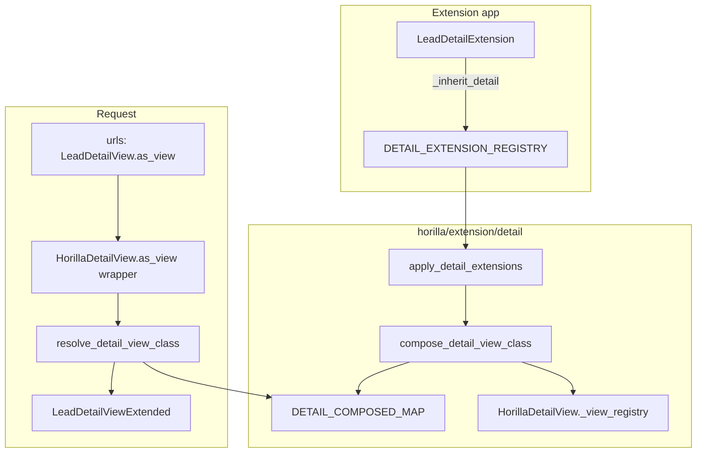

# Horilla `_inherit_detail` — Detail View Extension Guide

> **Status:** Implemented (`horilla/extension/detail/`)
> **Related:** [List `_inherit_list`](../list/inherit.md) · [Kanban `_inherit_kanban`](../kanban/inherit.md) · [Form `_inherit_form`](../forms/inherit.md) · [Model `_inherit`](../models/inherit.md)
> **Reference:** `horilla/contrib/generics/views/details.py` (`HorillaDetailView`)

Extend existing `HorillaDetailView` subclasses (Lead detail, Opportunity detail, etc.) **without** editing core `horilla_crm` view classes or URL names — using the same registration + composition workflow as `_inherit_list` and `_inherit_kanban`.

---

## Table of contents

1. [Problem](#problem)
2. [Relationship to other view extensions](#relationship-to-other-view-extensions)
3. [Solution overview](#solution-overview)
4. [Quick start](#quick-start)
5. [Rules](#rules)
6. [Layout hooks (class attributes)](#layout-hooks-class-attributes)
7. [Detail-specific hooks](#detail-specific-hooks)
8. [Method overrides](#method-overrides)
9. [Composition, MRO, and `_view_registry`](#composition-mro-and-_view_registry)
10. [Bootstrap and platform hooks](#bootstrap-and-platform-hooks)
11. [Package layout](#package-layout)
12. [Comparison with other extension mechanisms](#comparison-with-other-extension-mechanisms)
13. [Non-goals (v1)](#non-goals-v1)
14. [Acceptance criteria](#acceptance-criteria)
15. [Debugging](#debugging)
16. [Full example: Lead detail + `industry_code`](#full-example-lead-detail--industry_code)

---

## Problem

After model `_inherit`, form `_inherit_form`, list `_inherit_list`, and kanban `_inherit_kanban`, the **record detail page** still uses the core view’s hardcoded `body`, `actions`, and field visibility:

```python
# horilla_crm/leads/views/core.py — unchanged by model/form/list/kanban extension alone
class LeadDetailView(RecentlyViewedMixin, LoginRequiredMixin, HorillaDetailView):
    model = Lead
    body = [
        "title",
        "first_name",
        "last_name",
        "email",
        "lead_source",
        "industry",
        "lead_owner",
    ]
    excluded_fields = ["is_convert", "message_id"]
    pipeline_field = "lead_status"
    tab_url = reverse_lazy("leads:lead_detail_view_tabs")
    actions = LeadListView.actions
```

| Approach | Downside |
|----------|----------|
| Edit `horilla_crm/leads/views/core.py` | Lost on upstream merge |
| Subclass + new URL | Menus, HTMX pipeline POST, and field-selector defaults still reference core class / registry |
| Reuse only `_inherit_list` | Does **not** extend `LeadDetailView` (separate class, separate URL) |
| Copy `body` into templates | Breaks field permissions, split layout, and `DetailFieldVisibility` defaults |

`_inherit_detail` closes the detail-page gap the same way `_inherit_list` closes the table gap.

---

## Relationship to other view extensions

`HorillaDetailView` is **not** a subclass of `HorillaListView`. Detail, list, and kanban are three independent CBV trees:

```text
LeadDetailView  → HorillaDetailView  → DetailView
LeadListView    → HorillaListView    → ListView
LeadKanbanView  → HorillaKanbanView  → HorillaListView → ListView
```

| Topic | Behavior |
|-------|----------|
| Shared concept | Field lists use the same **insert/append** merge helpers as `columns_*` on list/kanban |
| `actions` format | Same dict structure as list/kanban `actions` (HTMX attrs, permissions, `condition_method`) |
| Detail-only | `body`, `header_fields`, `pipeline_field`, `badge`, `tab_url`, split layout exclusions |
| Registry | `HorillaDetailView._view_registry[model]` — used by pipeline POST, field selector, signals |
| Tab views | `HorillaDetailTabView` is a **separate** URL; v1 does not auto-extend tabs (see [Non-goals](#non-goals-v1)) |

**Recommendation for extension apps:** register every surface you touch:

```text
my_lead_extensions/
├── models.py    # _inherit
├── forms.py     # _inherit_form
├── lists.py     # _inherit_list  → LeadListView
├── kanbans.py   # _inherit_kanban → LeadKanbanView
└── details.py   # _inherit_detail → LeadDetailView
```

v1 does **not** sync `body_insert` with `columns_insert` automatically — duplicate hooks in `lists.py` and `details.py` when both UIs must show the same field.

---

## Solution overview



| Step | What happens |
|------|----------------|
| 1 | Extension app imports `details.py`; `DetailExtension` subclasses register via `__init_subclass__`. |
| 2 | `bootstrap_extensions()` → `apply_detail_extensions(force=True)` after `django.apps.ready`. |
| 3 | Platform builds `LeadDetailViewExtended` (merged attrs + extension mixins). |
| 4 | Composed class is registered on `HorillaDetailView._view_registry[model]`. |
| 5 | URLs keep `LeadDetailView.as_view()`; per-request resolution picks the composed class. |
| 6 | Optional `setup_detail_view_extension()` from composed `__init__`. |

Core CRM files and URL names stay unchanged.

### Why request-time resolution

`AppLauncher.ready()` registers detail URLs before extension apps import `details.py`. Resolving only at URL import time would bind the unextended view (same issue as list — see [list/inherit.md](../list/inherit.md#why-request-time-resolution)).

**Implemented:**

1. **`HorillaDetailView.as_view()`** — wrapper that calls `resolve_detail_view_class()` on each HTTP request (`horilla/contrib/generics/views/details.py`).
2. **`bootstrap_extensions()`** — composes detail extensions when URLconf loads.
3. Composed views call `setup_detail_view_extension()` from `HorillaDetailView.__init__`.

Clients only append their app in `local_settings.py`:

```python
INSTALLED_APPS += ["my_lead_extensions"]  # after horilla_crm.* is fine
```

---

## Quick start

Pair with model + form + list + kanban extensions for `industry_code` on Lead.

```python
# my_lead_extensions/details.py
from horilla.extension.detail import DetailExtension


class LeadDetailExtension(DetailExtension):
    _inherit_detail = "horilla_crm.leads.views.core.LeadDetailView"

    body_insert = [
        ("industry", "industry_code"),
    ]

    actions_append = []  # optional extra header actions
```

```python
# my_lead_extensions/apps.py
auto_import_modules = ["models", "forms", "lists", "kanbans", "details"]
```

```python
# local_settings.py — client-owned
INSTALLED_APPS += ["my_lead_extensions"]
```

Restart the dev server after changing detail extensions.

---

## Rules

| Topic | Rule |
|-------|------|
| Base class | `DetailExtension` (`horilla.extension.detail`) — do **not** instantiate |
| `_inherit_detail` | `"<module>.<ClassName>"` e.g. `"horilla_crm.leads.views.core.LeadDetailView"` |
| Naming | Under `horilla/`, use `DetailExtension` not `HorillaDetailExtension` — see [Extension index](../inherit.md#bootstrap) |
| Target | Concrete `HorillaDetailView` subclass, **not** bare `HorillaDetailView` |
| Layout | Use `*_insert` / `*_append` hooks — do not patch core `body` in place |
| Methods | Override `get_context_data`, `get_body`, `update_pipeline`, etc. with **`super()`** |
| Per-request tweaks | `setup_detail_view_extension()` — not `__init__` on the registration class |
| App order | Extension after CRM when possible; bootstrap + per-request resolve avoid strict reorder |
| Model fields | Field names in `body_*` must exist on the model (via `_inherit` or core) |
| URLs | Keep core URL names; resolution in `as_view()` |
| Registry | Composed class must register in `HorillaDetailView._view_registry` for the same `model` |

### `_inherit_detail` validation

| Rule | Result |
|------|--------|
| Invalid path (no dot) | Startup error (`detail_extensions.E001`) |
| Module import fails | Startup error (`detail_extensions.E002`) |
| Class missing | Startup error |
| Not a `HorillaDetailView` subclass | Startup error (`detail_extensions.E003`) |
| Target is bare `HorillaDetailView` | Startup error or warning (`detail_extensions.E004`) |

```bash
python manage.py check --tag detail_extensions
```

---

## Layout hooks (class attributes)

Reuse **column merge helpers** from `horilla.extension.list.merge` (`merge_columns` renamed conceptually for detail field lists — same tuple semantics).

### Field list entries

Detail views use **`body`** and **`header_fields`** instead of `columns`:

| Entry type | Example | Resolved as |
|------------|---------|-------------|
| String | `"industry_code"` | `(verbose_name, "industry_code")` via model `_meta` |
| Tuple (2) | `("Code", "industry_code")` | Custom verbose name |
| Tuple (nested) | Same conventions as `HorillaListView.columns` | Passed through `_normalize_field_list` |

### Body layout

| Hook | Type | Merged onto | Description |
|------|------|-------------|-------------|
| `body_insert` | `list[tuple[str, str \| tuple]]` | `body` | Insert after anchor: `[("industry", "industry_code"), …]` |
| `body_append` | `list[str \| tuple]` | `body` | Append if not already present |

`get_body()`, split-layout `get_detail_section_body()`, and `DetailFieldVisibility` defaults all derive from the composed `body` / exclusions.

### Header layout

| Hook | Type | Merged onto | Description |
|------|------|-------------|-------------|
| `header_fields_insert` | `list[tuple[str, str \| tuple]]` | `header_fields` | Insert into header strip |
| `header_fields_append` | `list[str \| tuple]` | `header_fields` | Append to header |

When `header_fields` is empty on the target, the first visible `body` field is used as header (core behavior) — extensions should set `body_insert` rather than relying on implicit header unless intentional.

### Exclusion hooks

| Hook | Type | Merged onto | Description |
|------|------|-------------|-------------|
| `excluded_fields_append` | `list[str]` | `excluded_fields` | Union append; extends `base_excluded_fields` at runtime via `get_excluded_fields()` |
| `split_excluded_fields_append` | `list[str]` | `split_excluded_fields` | Extra hides for split right panel only |

Do **not** merge `base_excluded_fields` in v1 (framework contract). Extensions only append to `excluded_fields` / `split_excluded_fields`.

### Actions and chrome

| Hook | Type | Merged onto | Description |
|------|------|-------------|-------------|
| `actions_append` | `list[dict]` | `actions` | Header action buttons (same schema as list) |
| `badge_append` | `list[dict]` | `badge` | Status badges (`condition`, `label`, `class`, optional `icon*`) |
| `breadcrumbs_append` | `list` | `breadcrumbs` | Static breadcrumb entries (rare; prefer method override) |

### Scalar overrides

Last extension by `(priority, INSTALLED_APPS order)` wins (`_inherit_detail_priority`):

| Attribute | Use |
|-----------|-----|
| `pipeline_field` | FK / choice field for stage pipeline (empty string to hide) |
| `tab_url` | HTMX tab container URL (`reverse_lazy(...)`) |
| `template_name` | **Discouraged** — breaks generic templates; override only with platform approval |
| `context_object_name` | Default `"obj"`; change only when required |

`final_stage_action` is usually a `@cached_property` on the target — override on the extension mixin or via method, not scalar merge in v1.

---

## Detail-specific hooks

Attributes and methods defined on `HorillaDetailView` beyond generic list behavior:

| Area | Core API | Extension approach (v1) |
|------|----------|-------------------------|
| Pipeline stage bar | `pipeline_field`, `get_pipeline_choices()`, `update_pipeline()` | Scalar override or method override with `super()` |
| Final stage CTA | `final_stage_action` | `@cached_property` on mixin |
| Split layout | `get_template_names()`, `split_excluded_fields` | `split_excluded_fields_append`; template stays core |
| Field visibility modal | `_get_details_section_url_for_fields()`, `tab_url` | Keep `tab_url` on target; extend tabs in v2 |
| Navigation prev/next | `_build_navigation_context()` | Method override |
| Custom pipeline colors | `get_pipeline_custom_colors()` | Method on extension mixin |
| Dynamic POST | `post()` → `_view_registry` → `update_pipeline()` | **Must** register composed class on registry |

### Consumers of `_view_registry` (implementation must update all)

| Location | Why composed class matters |
|----------|----------------------------|
| `HorillaDetailView.post()` (`pipeline_update`) | Delegates to `view_class.update_pipeline()` from registry |
| `helpers/detail_field.py` | Default header/body fields for `DetailFieldVisibility` |
| `horilla.contrib.core.signals` | Detail-related initialization |

---

## Method overrides

Extension contributions become **mixins** in the composed class MRO.

```python
class LeadDetailExtension(DetailExtension):
    _inherit_detail = "horilla_crm.leads.views.core.LeadDetailView"

    def get_context_data(self, **kwargs):
        context = super().get_context_data(**kwargs)
        context["show_industry_code_on_detail"] = True
        return context

    def update_pipeline(self, request, *args, **kwargs):
        """Custom stage change rules; call super() when delegating to default."""
        return super().update_pipeline(request, *args, **kwargs)
```

| Method | Policy |
|--------|--------|
| `get_context_data`, `dispatch`, `get_queryset` | Always `super()` unless replacing intentionally |
| `get_body`, `get_header_fields`, `get_excluded_fields` | Override when visibility logic is non-trivial |
| `get_pipeline_choices`, `update_pipeline`, `can_update_pipeline` | Pipeline customization |
| `get_badges` | Rare; prefer `badge_append` |
| `setup_detail_view_extension` | Optional; called from composed view `__init__` |
| `@cached_property` `final_stage_action` | Define on extension mixin |

Do **not** override `__init__` on `DetailExtension` registration classes.

---

## Composition, MRO, and `_view_registry`

### Composed class shape

```text
LeadDetailViewExtended
  → LeadDetailExtensionMixin
  → LeadDetailView              (core CRM)
  → RecentlyViewedMixin
  → LoginRequiredMixin
  → HorillaDetailView
  → DetailView
```

### Markers

```python
__horilla_detail_composed__ = True
__horilla_detail_path__ = "horilla_crm.leads.views.core.LeadDetailView"
__wrapped_detail_view__ = LeadDetailView
```

The original `LeadDetailView` class object is never modified.

### `_view_registry` (critical)

`HorillaDetailView` registers views in `__init_subclass__`:

```python
if hasattr(cls, "model") and cls.model:
    HorillaDetailView._view_registry[cls.model] = cls
```

Pipeline POST resolves:

```python
view_class = self._view_registry.get(model, self.__class__)
```

**Implementation requirement:** after `compose_detail_view_class()`, set:

```python
HorillaDetailView._view_registry[target.model] = composed_cls
```

Otherwise extensions that override `update_pipeline`, `body`, or `get_context_data` will not run on stage changes or field-selector defaults.

### Registry

```python
DETAIL_EXTENSION_REGISTRY = {
    "horilla_crm.leads.views.core.LeadDetailView": [DetailExtensionSpec(...), ...],
}
```

Optional priority:

```python
_inherit_detail_priority = 100  # higher = later in mixin order
```

---

## Bootstrap and platform hooks

Extension authors do not edit core for registration.

| Hook | Location | Purpose |
|------|----------|---------|
| `bootstrap_extensions()` | `horilla/extension/bootstrap.py` | Calls `apply_detail_extensions(force=True)` |
| `apply_detail_extensions()` | `horilla/extension/detail/bootstrap.py` | Build `DETAIL_COMPOSED_MAP`; clear `cache.RESOLVER_CACHE` |
| `resolve_detail_view_class()` | `horilla/extension/detail/resolve.py` | Per-request composed class |
| `HorillaDetailView.as_view()` | `horilla/contrib/generics/views/details.py` | Wrapper calling `resolve_detail_view_class()` |

`CoreConfig.ready()` also calls `apply_detail_extensions()` when `django.apps.ready` is true (secondary to URLconf bootstrap).

### Registration flow

1. `register_detail_extension()` appends to `DETAIL_EXTENSION_REGISTRY` and calls `cache.invalidate_after_registry_change()`.
2. `metaclass._compose_registered_target()` calls `apply_detail_extensions()` when apps are ready.
3. `registry.py` does not import `compose`; `compose_detail_view_class()` lazy-imports `get_detail_extensions_for()`.

See [Extension index](../inherit.md#registration-and-cache-invalidation) for the import graph.

### When your extension registers

| Mechanism | Registration trigger |
|-----------|----------------------|
| Model `_inherit` | Import `models.py` |
| Form `_inherit_form` | Import `forms.py` |
| List `_inherit_list` | Import `lists.py` |
| Kanban `_inherit_kanban` | Import `kanbans.py` |
| Detail `_inherit_detail` | Import `details.py` via `auto_import_modules` |

---

## Package layout

```text
horilla/extension/detail/
├── __init__.py          # DetailExtension, resolve_detail_view_class, …
├── cache.py             # RESOLVER_CACHE, LAST_FINGERPRINT (no upstream imports)
├── registry.py          # DETAIL_EXTENSION_REGISTRY, DetailExtensionSpec
├── metaclass.py         # DetailExtension registration (__init_subclass__)
├── merge.py             # merge_body / merge_header_fields (via list.merge)
├── compose.py           # compose_detail_view_class() + _view_registry update
├── resolve.py           # resolve_detail_view_class()
├── bootstrap.py         # apply_detail_extensions()
├── checks.py            # manage.py check --tag detail_extensions
├── debug.py             # get_detail_extensions(), print_detail_view_mro()
└── tests.py
```

### Public API (`horilla.extension.detail`)

```python
from horilla.extension.detail import (
    DetailExtension,
    resolve_detail_view_class,
    apply_detail_extensions,
    get_detail_extensions,
    print_detail_view_mro,
    clear_detail_extension_cache,
)
```

### `DetailExtensionSpec` fields

| Field | Purpose |
|-------|---------|
| `inherit_detail` | Target path string |
| `class_name`, `module`, `extension_app_label`, `priority` | Metadata |
| `body_insert`, `body_append` | Body field list deltas |
| `header_fields_insert`, `header_fields_append` | Header deltas |
| `excluded_fields_append`, `split_excluded_fields_append` | Exclusion deltas |
| `actions_append`, `badge_append`, `breadcrumbs_append` | UI chrome deltas |
| `scalar_overrides` | `pipeline_field`, `tab_url`, `template_name`, `context_object_name` |
| `class_attrs` | Methods copied onto mixin |
| `override_attrs` | Full replacement attrs (frozenset) |

---

## Comparison with other extension mechanisms

| | `_inherit_list` | `_inherit_kanban` | `_inherit_detail` |
|--|-----------------|-------------------|-------------------|
| Target base | `HorillaListView` | `HorillaKanbanView` | `HorillaDetailView` |
| Registration key | `_inherit_list` | `_inherit_kanban` | `_inherit_detail` |
| Extension base | `ListExtension` | `KanbanExtension` | `DetailExtension` |
| Primary field hook | `columns_*` | `columns_*` | `body_*` |
| Composed map | `LIST_COMPOSED_MAP` | `KANBAN_COMPOSED_MAP` | `DETAIL_COMPOSED_MAP` |
| Extra platform concern | — | `_view_registry` (drag-drop) | `_view_registry` (pipeline POST, field defaults) |
| `as_view()` wrapper | `HorillaListView` | Via list wrapper for kanban | `HorillaDetailView` |
| Typical CRM example | `LeadListView` | `LeadKanbanView` | `LeadDetailView` |

### Five-layer extension app

```text
my_lead_extensions/
├── models.py
├── forms.py
├── lists.py
├── kanbans.py
├── details.py     # _inherit_detail = "...LeadDetailView"
└── migrations/
```

---

## Non-goals (v1)

- Template / xpath inheritance for `detail_view.html` / `detail_view_split_fragment.html`
- **`_inherit_detail_tab`** — extending `HorillaDetailTabView` tab definitions (separate future spec)
- Card view / timeline / related-list section extension
- Automatic sync between `body_insert` and `columns_insert`
- Generic dynamic detail (`model` from query string only, no concrete subclass)
- Hot-reload without server restart
- Merging `base_excluded_fields` from extensions
- Changing `model` on the target via extension

---

## Acceptance criteria

- [x] Extension app adds detail `body` fields without editing `horilla_crm` views
- [x] Core CRM detail URLs unchanged (`leads:lead_detail` still uses `LeadDetailView.as_view()`)
- [x] `python manage.py check --tag detail_extensions` passes
- [x] Pipeline HTMX POST uses composed class from `_view_registry`
- [x] `DetailFieldVisibility` defaults reflect composed `body` / `excluded_fields`
- [x] `actions_append` with `condition_method` works on detail header actions
- [x] `body_insert` shows injected model fields with field-level permissions respected
- [x] Uninstalling extension app removes composed class from map and registry
- [x] Documented in [extension index](../inherit.md) next to list, kanban, and form guides
- [x] `docs/coding_rule.md` mentions `DetailExtension` / `_inherit_detail`

---

## Debugging

```python
from horilla.extension.detail import get_detail_extensions, print_detail_view_mro

print(get_detail_extensions("horilla_crm.leads.views.core.LeadDetailView"))
print_detail_view_mro("horilla_crm.leads.views.core.LeadDetailView")
```

```bash
python manage.py check --tag detail_extensions
```

```python
from horilla.extension.detail import resolve_detail_view_class
from horilla_crm.leads.views.core import LeadDetailView

cls = resolve_detail_view_class(LeadDetailView)
print(cls.body)
print(HorillaDetailView._view_registry.get(LeadDetailView.model))
```

---

## Full example: Lead detail + `industry_code`

Assumes `LeadExtension` with `industry_code` and list/form/kanban extensions in `my_lead_extensions/`.

```python
# my_lead_extensions/details.py
from horilla.extension.detail import DetailExtension


class LeadDetailExtension(DetailExtension):
    """
    Show industry_code on Lead detail body; keep list/kanban in sync via lists.py + kanbans.py.
    """

    _inherit_detail = "horilla_crm.leads.views.core.LeadDetailView"
    _inherit_detail_priority = 0

    body_insert = [
        ("industry", "industry_code"),
    ]

    # Hide from split panel auto-field sweep if needed
    split_excluded_fields_append = []

    def get_context_data(self, **kwargs):
        context = super().get_context_data(**kwargs)
        return context
```

```python
# my_lead_extensions/apps.py
auto_import_modules = ["models", "forms", "lists", "kanbans", "details"]
```

List, kanban, and detail stay aligned by duplicating field hooks in v1:

```python
# lists.py
columns_insert = [("industry", "industry_code")]

# kanbans.py
columns_insert = [("industry", "industry_code")]

# details.py
body_insert = [("industry", "industry_code")]
```

---

## See also

- [list/inherit.md](../list/inherit.md) — implemented list extension (template for merge/compose)
- [kanban/inherit.md](../kanban/inherit.md) — `_view_registry` pattern for POST delegation
- [forms/inherit.md](../forms/inherit.md) — `_inherit_form`
- [models/inherit.md](../models/inherit.md) — `_inherit`
- `horilla/contrib/generics/views/details.py` — core `HorillaDetailView` behavior
- [coding_rule.md](../../../coding_rule.md) — naming rules (`DetailExtension`)
