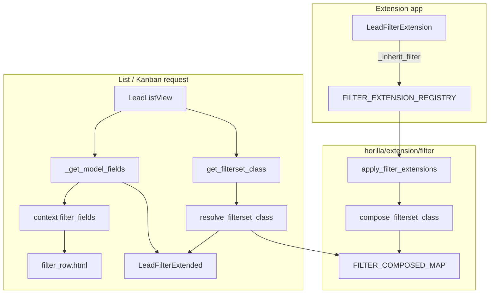

# `_inherit_filter` — Technical specification

> **Status:** Implemented (`horilla/extension/filter/`)
> **User guide:** [inherit.md](./inherit.md)
> **Index:** [../inherit.md](../inherit.md)

---

## 1. Purpose

Extend existing `HorillaFilterSet` subclasses (e.g. `LeadFilter`) from extension apps **without** editing `horilla_crm/*/filters.py`, using the same registration + composition pattern as `_inherit_form`.

| Problem | Solution |
|---------|----------|
| Hide injected field from filter panel dropdown | `exclude_append` → composed `Meta.exclude` → `_get_model_fields()` |
| Global search in filter panel | `search_fields_append` on composed `Meta` |
| Explicit `Meta.fields` omits new columns | `fields_append` |
| Custom `django_filters.Filter` | `declared_filters` on `FilterExtension` |
| Subclass `LeadFilter` + per-view `filterset_class` | `_inherit_filter` + `HorillaListView.get_filterset_class()` |

---

## 2. Registration API

| Attribute | Required | Description |
|-----------|----------|-------------|
| `_inherit_filter` | Yes | Dotted path: `"horilla_crm.leads.filters.LeadFilter"` |
| `_inherit_filter_priority` | No | Higher = later mixin (wins conflicts). Default `0`. |
| `override_filters` | No | `frozenset` of declared filter names allowed to replace prior extensions |

### Meta hooks (inner `Meta` on extension class)

| Hook | Merges into target `Meta` |
|------|---------------------------|
| `exclude` | Union append |
| `search_fields` | Union append |
| `fields` | When target `fields` is a list/tuple (not `"__all__"`), union append |
| `name_split_fields` | Replace if set on extension `Meta` |

### Class-level layout hooks (no inner `Meta`)

| Hook | Behavior |
|------|----------|
| `search_fields_append` | Append to `Meta.search_fields` |
| `search_fields_insert` | `[(after_field, new_field), ...]` |
| `exclude_append` | Append to `Meta.exclude` |
| `fields_append` | Append to `Meta.fields` when target is not `"__all__"` |

### Declared filters

Any `django_filters.Filter` instance on the extension class body is merged into the composed filterset.

### Methods

Callable attributes on the extension class body (except layout keys and dunder) become mixin methods; use `super()` to wrap target behavior.

### Instance hook — `setup_filter_extension`

| Detail | Behavior |
|--------|----------|
| Defined on | Extension subclass (optional override) |
| Default | No-op injected on each composed **mixin** in `compose._spec_to_mixin()` |
| Called from | Composed filterset `__init__` after `FilterSet.__init__` |
| Note | Methods inherited only from `FilterExtension` base are **not** copied into the mixin; only `cls.__dict__` callables are. The composer always provides a mixin-level `setup_filter_extension` so `__init__` never raises `AttributeError`. |

---

## 3. Package layout

```text
horilla/extension/filter/
├── __init__.py       # public API + loads checks
├── registry.py       # FILTER_*_REGISTRY, FilterExtensionSpec
├── cache.py          # RESOLVER_CACHE, BOOTSTRAP_APPLIED (no compose imports)
├── metaclass.py      # FilterExtension, register_filter_extension_class
├── compose.py        # compose_filterset_class, _spec_to_mixin
├── resolve.py        # resolve_filterset_class
├── bootstrap.py      # apply_filter_extensions
├── checks.py         # filter_extensions.E001–E004
├── debug.py          # get_filter_extensions, print_filter_mro
└── tests.py
```

---

## 4. Runtime flow



| Step | Module | Action |
|------|--------|--------|
| 1 | `metaclass.py` | `FilterExtension.__init_subclass__` → `FilterExtensionSpec` → `register_filter_extension()` |
| 2 | `registry.py` | Append to registry; `cache.invalidate_all()` |
| 3 | `bootstrap.py` | `apply_filter_extensions(force=True)` from `bootstrap_extensions()` |
| 4 | `resolve.py` | `resolve_filterset_class(LeadFilter)` → composed class or original |
| 5 | `list.py` | `get_filterset_class()`; `get_queryset()` instantiates composed class |
| 6 | `mixins.py` | `_get_model_fields()` reads `get_filterset_class().Meta.exclude` |

**Resolution timing:** Per `get_filterset_class()` / `resolve_filterset_class()` (like forms), not per HTTP `as_view()` wrapper. Safe when extension apps load after CRM.

---

## 5. Composition rules

| Rule | Detail |
|------|--------|
| MRO | `LeadFilterExtended` → `ExtNMixin` → … → `Ext1Mixin` → `LeadFilter` → … |
| Markers | `__horilla_composed__`, `__horilla_filter_path__`, `__wrapped_filter__` |
| Target unchanged | Core `LeadFilter` class object never mutated |
| Duplicate declared filters | Error unless `override_filters` allows |
| `fields == "__all__"` | Injected ORM fields appear in filter UI unless in `exclude`; use `search_fields_append` for search |
| `fields` explicit list | Use `fields_append` to add names |

---

## 6. Platform integration

| Location | Change |
|----------|--------|
| `horilla/extension/bootstrap.py` | `apply_filter_extensions(force=True)` |
| `horilla/contrib/core/apps.py` | `apply_filter_extensions()` in `ready()` |
| `horilla/contrib/generics/views/list.py` | `get_filterset_class()`; filterset instantiation uses it |
| `horilla/contrib/generics/mixins.py` | `HorillaListFilterFieldsMixin._get_model_fields()` uses `get_filterset_class()` |
| `horilla/contrib/generics/views/toolkit/quick_filter.py` | `view.get_filterset_class()` when resolving FK querysets |
| `horilla/contrib/generics/views/kanban.py` | `get_filterset_class()` for kanban filter context |

### Filter panel UI path

| Template | Context key | Source |
|----------|-------------|--------|
| `partials/filter_row.html` | `filter_fields` | `HorillaListView.get_context_data()` → `_get_model_fields()` |
| `filterpanel.html` | includes `filter_row.html` | Same context on list/kanban GET |

Excluded field names never enter `filter_fields`, so they do not appear in the field `<select>`.

**Not controlled by `_inherit_filter`:** navbar quick filters (`exclude_quick_filter_fields` on list view / `exclude_quick_filter_fields_append` on `_inherit_list`).

---

## 7. System checks

```bash
python manage.py check   # filter_extensions.E001–E004 when extension apps are installed
```

Checks register under Django’s model check phase (`Tags.models`); there is no separate `--tag filter_extensions` CLI tag in current Django versions.

| ID | Condition |
|----|-----------|
| `filter_extensions.E001` | Invalid `_inherit_filter` path format |
| `filter_extensions.E002` | Target import failure |
| `filter_extensions.E003` | Target is not a `django_filters.FilterSet` subclass |
| `filter_extensions.E004` | Duplicate declared filter name across extensions |

---

## 8. Non-goals (v1)

- Auto-composing filtersets for views with `filterset_class = None`
- Replacing target `Meta.model`
- Filter extension without a concrete CRM `HorillaFilterSet` subclass
- DRF filter backend extension (use manual serializer/filter classes)
- Template / xpath changes to `filter_row.html`
- Hot-reload without process restart
- Quick filter chips (use list view `exclude_quick_filter_fields`)

---

## 9. Acceptance criteria

- [x] Extension app extends `LeadFilter` via `_inherit_filter` only
- [x] `LeadListView` uses composed class via `get_filterset_class()`
- [x] `exclude_append` removes fields from `filter_fields` / `filter_row.html`
- [x] `search_fields_append` affects `filter_search` behavior
- [x] `fields_append` works when target uses explicit field lists
- [x] Composed filterset instantiates without `setup_filter_extension` errors
- [x] `python manage.py test horilla.extension.filter.tests` passes
- [x] Documented in extension index + `my_lead_extensions/filters.py`

---

## 10. See also

- [inherit.md](./inherit.md) — developer guide, troubleshooting (`industry` vs `industry_code`)
- [forms/inherit.md](../forms/inherit.md) — parallel pattern for forms
- [list/inherit.md](../list/inherit.md) — list columns, quick filters
