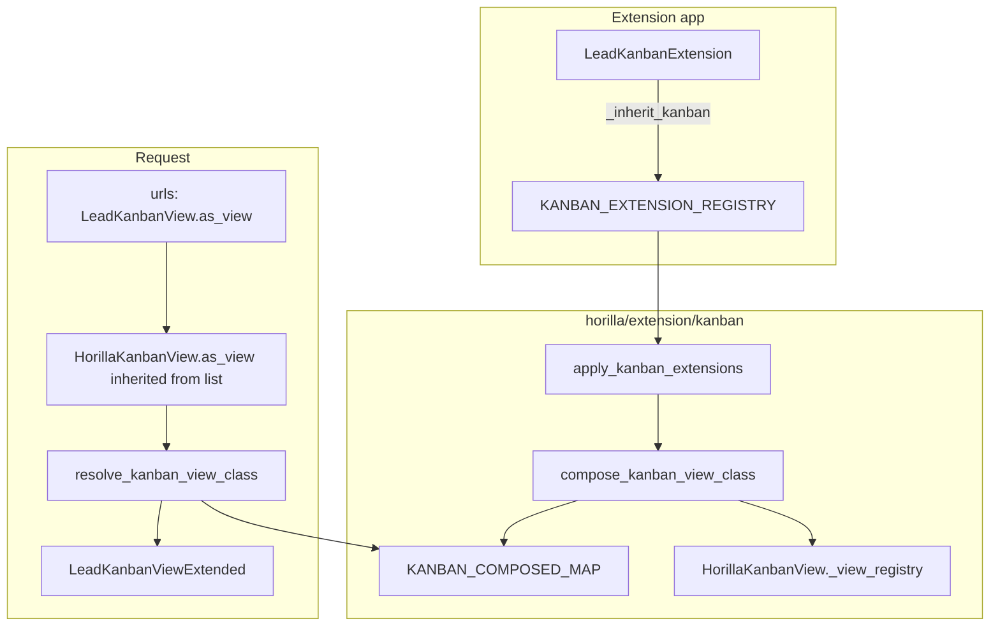

# Horilla `_inherit_kanban` — Kanban View Extension Guide

> **Status:** Implemented (`horilla/extension/kanban/`)
> **Related:** [List `_inherit_list`](../list/inherit.md) · [Detail `_inherit_detail`](../detail/inherit.md) · [Form `_inherit_form`](../forms/inherit.md) · [Model `_inherit`](../models/inherit.md)
> **Reference:** `horilla/contrib/generics/views/kanban.py` (`HorillaKanbanView`)

Extend existing `HorillaKanbanView` subclasses (Lead kanban, Opportunity kanban, etc.) **without** editing core `horilla_crm` view classes or URL names — using the same workflow as `_inherit_list`.

---

## Table of contents

1. [Problem](#problem)
2. [Relationship to `_inherit_list`](#relationship-to-_inherit_list)
3. [Solution overview](#solution-overview)
4. [Quick start](#quick-start)
5. [Rules](#rules)
6. [Layout hooks (class attributes)](#layout-hooks-class-attributes)
7. [Kanban-specific hooks](#kanban-specific-hooks)
8. [Method overrides](#method-overrides)
9. [Composition, MRO, and `_view_registry`](#composition-mro-and-_view_registry)
10. [Bootstrap and platform hooks](#bootstrap-and-platform-hooks)
11. [Package layout](#package-layout)
12. [Comparison with other extension mechanisms](#comparison-with-other-extension-mechanisms)
13. [Non-goals (v1)](#non-goals-v1)
14. [Acceptance criteria](#acceptance-criteria)
15. [Debugging](#debugging)
16. [Full example: Lead kanban + `industry_code`](#full-example-lead-kanban--industry_code)

---

## Problem

After model `_inherit` and form/list extensions, the **kanban board** still uses the core view’s hardcoded `columns`, `actions`, and card field visibility:

```python
# horilla_crm/leads/views/core.py — unchanged by model/form/list extension alone
class LeadKanbanView(LoginRequiredMixin, HorillaKanbanView):
    model = Lead
    group_by_field = "lead_status"
    columns = [
        "title",
        "first_name",
        "email",
        "lead_source",
        "industry",
        "annual_revenue",
    ]
    actions = LeadListView.actions
```

| Approach | Downside |
|----------|----------|
| Edit `horilla_crm/leads/views/core.py` | Lost on upstream merge |
| Subclass + new URL | Menus and HTMX drag-drop POST still reference core `class_name` / registry |
| Reuse only `_inherit_list` on `LeadListView` | Does **not** extend `LeadKanbanView` (separate class, separate URL) |

`_inherit_kanban` closes the kanban gap the same way `_inherit_list` closes the table list gap.

---

## Relationship to `_inherit_list`

`HorillaKanbanView` **subclasses** `HorillaListView`:

```text
LeadKanbanView → HorillaKanbanView → HorillaListView → ListView
```

| Topic | Behavior |
|-------|----------|
| `HorillaListView.as_view()` wrapper | Already runs for kanban URLs (inherited `as_view`) |
| `_inherit_list` on `LeadListView` | Affects **list/table** only, not `LeadKanbanView` |
| `_inherit_kanban` on `LeadKanbanView` | Affects **kanban** only |
| Shared hooks | `columns_*`, `actions_append`, `bulk_update_fields_append`, etc. — same merge semantics as list |
| Kanban-only | `exclude_kanban_fields_*`, `kanban_order_by`, registry for drag-drop |

**Recommendation for extension apps:** register **both** when you need table + board:

```text
my_lead_extensions/
├── lists.py    # _inherit_list  → LeadListView
├── kanbans.py  # _inherit_kanban → LeadKanbanView
└── details.py  # _inherit_detail → LeadDetailView (when detail body must match)
```

---

## Solution overview



| Step | What happens |
|------|----------------|
| 1 | Extension app imports `kanbans.py`; `KanbanExtension` subclasses register via `__init_subclass__`. |
| 2 | `bootstrap_extensions()` → `apply_kanban_extensions(force=True)` after `django.apps.ready`. |
| 3 | Platform builds `LeadKanbanViewExtended` (merged attrs + extension mixins). |
| 4 | Composed class is registered on `HorillaKanbanView._view_registry[model]` (required for drag-drop POST). |
| 5 | URLs keep `LeadKanbanView.as_view()`; per-request resolution picks the composed class. |
| 6 | Optional `setup_kanban_view_extension()` from composed `__init__`. |

Core CRM files and URL names stay unchanged.

### Why request-time resolution (same as list)

`AppLauncher.ready()` registers kanban URLs before extension apps import `kanbans.py`. Resolving only at URL import time would bind the unextended view.

**Implemented (mirror list):**

1. **`resolve_kanban_view_class()`** on each HTTP request via `HorillaListView.as_view()` when `issubclass(cls, HorillaKanbanView)`.
2. **`bootstrap_extensions()`** composes kanban extensions when URLconf loads.

Clients only append their app in `local_settings.py`:

```python
INSTALLED_APPS += ["my_lead_extensions"]  # after horilla_crm.* is fine
```

---

## Quick start

Pair with model + form + list extensions for `industry_code` on Lead.

```python
# my_lead_extensions/kanbans.py
from horilla.extension.kanban import KanbanExtension


class LeadKanbanExtension(KanbanExtension):
    _inherit_kanban = "horilla_crm.leads.views.core.LeadKanbanView"

    columns_insert = [
        ("industry", "industry_code"),
    ]

    actions_append = []  # or extra card actions; often reuse list actions via core
```

```python
# my_lead_extensions/apps.py
auto_import_modules = ["models", "forms", "lists", "kanbans", "details"]
```

```python
# local_settings.py — client-owned
INSTALLED_APPS += ["my_lead_extensions"]
```

Restart the dev server after changing kanban extensions.

---

## Rules

| Topic | Rule |
|-------|------|
| Base class | `KanbanExtension` (`horilla.extension.kanban`) — do **not** instantiate |
| `_inherit_kanban` | `"<module>.<ClassName>"` e.g. `"horilla_crm.leads.views.core.LeadKanbanView"` |
| Naming | Under `horilla/`, use `KanbanExtension` not `HorillaKanbanExtension` — see [Extension index](../inherit.md#bootstrap) |
| Target | Concrete `HorillaKanbanView` subclass, **not** bare `HorillaKanbanView` |
| Layout | Use `*_insert` / `*_append` hooks — do not patch core `columns` in place |
| Methods | Override `get_queryset`, `get_context_data`, `update_kanban_item`, etc. with **`super()`** |
| Per-request tweaks | `setup_kanban_view_extension()` — not `__init__` on the registration class |
| App order | Extension after CRM when possible; bootstrap + per-request resolve avoid strict reorder |
| Model fields | Column names must exist on the model (via `_inherit` or core) |
| URLs | Keep core URL names; resolution in `as_view()` |
| Registry | Composed class must register in `HorillaKanbanView._view_registry` for the same `model` |

### `_inherit_kanban` validation

| Rule | Result |
|------|--------|
| Invalid path (no dot) | Startup error (`kanban_extensions.E001`) |
| Module import fails | Startup error (`kanban_extensions.E002`) |
| Class missing | Startup error |
| Not a `HorillaKanbanView` subclass | Startup error (`kanban_extensions.E003`) |
| Target is bare `HorillaKanbanView` | Startup error or warning (`kanban_extensions.E004`) |

```bash
python manage.py check --tag kanban_extensions
```

---

## Layout hooks (class attributes)

Reuse the **same merge helpers** as `_inherit_list` (shared `merge.py` or import from `horilla.extension.list.merge`).

### Column layout

| Hook | Type | Description |
|------|------|-------------|
| `columns_insert` | `list[tuple[str, str \| tuple]]` | Insert after anchor: `[("industry", "industry_code"), …]` |
| `columns_append` | `list[str \| tuple]` | Append if not already present |

Kanban cards render `columns` on each record (see `kanban_view.html` / partials). Tuple verbose names follow `HorillaListView` conventions.

### List-compatible append hooks

| Extension hook | Merged onto target attribute |
|----------------|------------------------------|
| `bulk_update_fields_append` | `bulk_update_fields` |
| `export_exclude_append` | `export_exclude` |
| `exclude_columns_append` | `exclude_columns` |
| `actions_append` | `actions` |
| `custom_bulk_actions_append` | `custom_bulk_actions` |
| `additional_action_button_append` | `additional_action_button` |
| `exclude_quick_filter_fields_append` | `exclude_quick_filter_fields` |
| `exclude_columns_from_sorting_append` | `exclude_columns_from_sorting` |

### Scalar overrides

| Attribute | Use |
|-----------|-----|
| `filterset_class` | Extended `FilterSet` for kanban filters |
| `paginate_by` | Cards per column page (kanban default `30`) |
| `view_id` | Kanban view id (saved settings keys) |
| `default_sort_field` / `default_sort_direction` | Inherited list sort defaults |
| `enable_quick_filters` | Toggle quick filters on kanban toolbar |
| `bulk_update_option` / `bulk_export_option` | Toolbar options |
| `owner_filtration` | Owner-scoped queryset |

**Conflict resolution:** `(priority, INSTALLED_APPS order)` — same as list (`_inherit_kanban_priority`).

---

## Kanban-specific hooks

Attributes defined on `HorillaKanbanView` beyond the list base:

| Hook | Type | Merged onto | Description |
|------|------|-------------|-------------|
| `exclude_kanban_fields_append` | `list[str]` | `exclude_kanban_fields` | Append field names to CSV exclude string (settings / group-by UI) |
| `kanban_order_by` | scalar | `kanban_order_by` | Order within column, e.g. `"-updated_at"` |
| `height_kanban` | scalar | `height_kanban` | CSS height class for board |
| `group_by_field` | scalar | `group_by_field` | **Use with care** — changes pipeline column; prefer method override |

### Not merged in v1 (override via methods)

| Target | Reason |
|--------|--------|
| `kanban_attrs` | Usually `@cached_property` dict — override on extension mixin or `setup_kanban_view_extension` |
| `template_name`, `main_url`, `search_url` | Routing contract |
| `model` | Must stay the extended model class |
| `filterset_module` | Rare; override via scalar if needed |

### `exclude_kanban_fields` merge rule

Core stores a **comma-separated string**:

```python
exclude_kanban_fields = "lead_owner"
```

Composer behavior:

```python
# base: "lead_owner", append: ["industry_code"]
# → "lead_owner,industry_code"
```

Skip duplicates; preserve order (base fields first, then extensions).

---

## Method overrides

Extension contributions become **mixins** in the composed class MRO.

```python
class LeadKanbanExtension(KanbanExtension):
    _inherit_kanban = "horilla_crm.leads.views.core.LeadKanbanView"

    def get_context_data(self, **kwargs):
        context = super().get_context_data(**kwargs)
        context["show_industry_code_on_cards"] = True
        return context

    def update_kanban_item(self, request):
        """Custom drag-drop logic; must call super() when delegating to default."""
        return super().update_kanban_item(request)
```

| Method | Policy |
|--------|--------|
| `get_queryset`, `get_context_data`, `dispatch` | Always `super()` unless replacing behavior intentionally |
| `update_kanban_item`, `update_kanban_column_order` | Override for custom pipeline rules; registry must point at composed class |
| `get_kanban_order_by`, `get_group_by_field`, `can_user_modify_item` | Common extension points |
| `setup_kanban_view_extension` | Optional; called from composed view `__init__` |
| `@cached_property` `kanban_attrs` | Define on extension mixin |

Do **not** override `__init__` on `KanbanExtension` registration classes.

---

## Composition, MRO, and `_view_registry`

### Composed class shape

```text
LeadKanbanViewExtended
  → LeadKanbanExtensionMixin
  → LeadKanbanView              (core CRM)
  → HorillaKanbanView
  → HorillaListView
  → HorillaListViewMixin
  → ListView
```

### Markers

```python
__horilla_kanban_composed__ = True
__horilla_kanban_path__ = "horilla_crm.leads.views.core.LeadKanbanView"
__wrapped_kanban_view__ = LeadKanbanView
```

The original `LeadKanbanView` class object is never modified.

### `_view_registry` (critical)

`HorillaKanbanView` registers views in `__init_subclass__`:

```python
if hasattr(cls, "model") and cls.model:
    HorillaKanbanView._view_registry[cls.model] = cls
```

Drag-and-drop POST (`update_kanban_item`) resolves:

```python
view_class = HorillaKanbanView._view_registry.get(self.model)
```

**Implementation requirement:** after `compose_kanban_view_class()`, register the **composed** class for `target.model`, not only the core class. Otherwise extensions that override `update_kanban_item` or `get_queryset` will not run on card moves.

### Registry

```python
KANBAN_EXTENSION_REGISTRY = {
    "horilla_crm.leads.views.core.LeadKanbanView": [KanbanExtensionSpec(...), ...],
}
```

Optional priority:

```python
_inherit_kanban_priority = 100  # higher = later in mixin order
```

---

## Bootstrap and platform hooks

Extension authors do not edit core for registration.

| Hook | Location | Purpose |
|------|----------|---------|
| `bootstrap_extensions()` | `horilla/extension/bootstrap.py` | Calls `apply_kanban_extensions(force=True)` |
| `apply_kanban_extensions()` | `horilla/extension/kanban/bootstrap.py` | Build `KANBAN_COMPOSED_MAP`; clear `cache.RESOLVER_CACHE` |
| `resolve_kanban_view_class()` | `horilla/extension/kanban/resolve.py` | Per-request composed class |
| `HorillaListView.as_view()` | `horilla/contrib/generics/views/list.py` | Calls `resolve_kanban_view_class` when `issubclass(cls, HorillaKanbanView)` |

```python
if issubclass(cls, HorillaKanbanView):
    resolved = resolve_kanban_view_class(cls)
else:
    resolved = resolve_list_view_class(cls)
```

`CoreConfig.ready()` also calls `apply_kanban_extensions()` when `django.apps.ready` is true (secondary to URLconf bootstrap).

### Registration flow

1. `register_kanban_extension()` appends to `KANBAN_EXTENSION_REGISTRY` and calls `cache.invalidate_after_registry_change()`.
2. `metaclass._compose_registered_target()` calls `apply_kanban_extensions()` when apps are ready.
3. `registry.py` does not import `compose`; `compose_kanban_view_class()` lazy-imports `get_kanban_extensions_for()`.

### When your extension registers

| Mechanism | Registration trigger |
|-----------|----------------------|
| Model `_inherit` | Import `models.py` |
| Form `_inherit_form` | Import `forms.py` |
| List `_inherit_list` | Import `lists.py` |
| Kanban `_inherit_kanban` | Import `kanbans.py` via `auto_import_modules` |
| Detail `_inherit_detail` | Import `details.py` via `auto_import_modules` |

---

## Package layout

```text
horilla/extension/kanban/
├── __init__.py          # KanbanExtension, resolve_kanban_view_class, …
├── cache.py             # RESOLVER_CACHE, LAST_FINGERPRINT (no upstream imports)
├── registry.py          # KANBAN_EXTENSION_REGISTRY, KanbanExtensionSpec
├── metaclass.py         # KanbanExtension registration
├── merge.py             # merge_exclude_kanban_fields (compose uses list.merge for columns)
├── compose.py           # compose_kanban_view_class() + _view_registry update
├── resolve.py           # resolve_kanban_view_class()
├── bootstrap.py         # apply_kanban_extensions()
├── checks.py            # manage.py check --tag kanban_extensions
├── debug.py             # get_kanban_extensions(), print_kanban_view_mro()
└── tests.py
```

Public API (`horilla.extension.kanban`):

```python
from horilla.extension.kanban import (
    KanbanExtension,
    resolve_kanban_view_class,
    apply_kanban_extensions,
    get_kanban_extensions,
    print_kanban_view_mro,
)
```

---

## Comparison with other extension mechanisms

| | `_inherit_list` | `_inherit_kanban` | `_inherit_detail` |
|--|-----------------|-------------------|-------------------|
| Target base | `HorillaListView` | `HorillaKanbanView` | `HorillaDetailView` |
| Registration key | `_inherit_list` | `_inherit_kanban` | `_inherit_detail` |
| Extension base | `ListExtension` | `KanbanExtension` | `DetailExtension` |
| Primary field hook | `columns_*` | `columns_*` | `body_*` |
| Composed map | `LIST_COMPOSED_MAP` | `KANBAN_COMPOSED_MAP` | `DETAIL_COMPOSED_MAP` |
| Extra platform concern | — | `_view_registry` (drag-drop) | `_view_registry` (pipeline POST) |
| `as_view()` wrapper | `HorillaListView` | Via list wrapper | `HorillaDetailView` |
| Typical CRM example | `LeadListView` | `LeadKanbanView` | `LeadDetailView` |

### Five-layer extension app

```text
my_lead_extensions/
├── models.py
├── forms.py
├── lists.py
├── kanbans.py
├── details.py
└── migrations/
```

---

## Non-goals (v1)

- Template / xpath inheritance for `kanban_view.html`
- Generic dynamic kanban (`model` from URL only, no concrete subclass)
- Filter panel / filterset — use [_inherit_filter](../filter/inherit.md) (`get_filterset_class()` on list/kanban views)
- Card view / timeline / detail extension (separate future specs)
- Sharing one extension class for both list and kanban targets (use two registrations)
- Hot-reload without server restart

---

## Acceptance criteria

- [x] Extension app adds kanban card columns without editing `horilla_crm` views
- [x] Core CRM kanban URLs unchanged
- [x] `python manage.py check --tag kanban_extensions` passes
- [x] Drag-drop POST uses composed class from `_view_registry`
- [x] `actions_append` with `condition_method` works on kanban cards (via shared action tags)
- [x] `columns_insert` shows injected model fields on cards
- [x] Uninstalling extension app removes composed class from map and registry
- [x] Documented in [extension index](../inherit.md) next to list and form guides
- [x] `docs/coding_rule.md` mentions `KanbanExtension` / `_inherit_kanban`

---

## Debugging

```python
from horilla.extension.kanban import get_kanban_extensions, print_kanban_view_mro

print(get_kanban_extensions("horilla_crm.leads.views.core.LeadKanbanView"))
print_kanban_view_mro("horilla_crm.leads.views.core.LeadKanbanView")
```

```bash
python manage.py check --tag kanban_extensions
```

```python
from horilla.extension.kanban import resolve_kanban_view_class
from horilla_crm.leads.views.core import LeadKanbanView

cls = resolve_kanban_view_class(LeadKanbanView)
print(cls.columns)
print(HorillaKanbanView._view_registry.get(LeadKanbanView.model))
```

---

## Full example: Lead kanban + `industry_code`

Assumes `LeadExtension` with `industry_code` and list/form extensions in `my_lead_extensions/`.

```python
# my_lead_extensions/kanbans.py
from horilla.extension.kanban import KanbanExtension


class LeadKanbanExtension(KanbanExtension):
    """
    Show industry_code on Lead kanban cards; keep list extension in lists.py.
    """

    _inherit_kanban = "horilla_crm.leads.views.core.LeadKanbanView"
    _inherit_kanban_priority = 0

    columns_insert = [
        ("industry", "industry_code"),
    ]

    # Hide injected field from kanban "group by" settings if needed
    exclude_kanban_fields_append = ["industry_code"]

    def get_context_data(self, **kwargs):
        context = super().get_context_data(**kwargs)
        # Example: same final-stage column filter as core LeadKanbanView
        return context
```

```python
# my_lead_extensions/apps.py
auto_import_modules = ["models", "forms", "lists", "kanbans", "details"]
```

List table and kanban board stay in sync by duplicating `columns_insert` in `lists.py` and `kanbans.py` (v1). A future `_inherit_kanban_from_list` helper is out of scope.

---

## Implementation checklist (for developers)

1. Copy `horilla/extension/list/` structure → `horilla/extension/kanban/`
2. Rename symbols: `ListExtension` → `KanbanExtension`, `_inherit_list` → `_inherit_kanban`, etc.
3. Validate target is subclass of `HorillaKanbanView`
4. Reuse `merge_columns` / append hooks from list merge module
5. Add `merge_exclude_kanban_fields(base: str, append: list[str]) -> str`
6. In `compose_kanban_view_class`, set `_view_registry[model] = composed_cls`
7. Wire `resolve_kanban_view_class` in `HorillaListView.as_view()` (or kanban override)
8. Extend `bootstrap_extensions()` and `CoreConfig.ready()`
9. Add tests mirroring `horilla.extension.list.tests`
10. Update [inherit.md](../inherit.md), [list/inherit.md](../list/inherit.md) non-goals, [coding_rule.md](../../../coding_rule.md)

---

## See also

- [list/inherit.md](../list/inherit.md) — implemented list extension (template for kanban)
- [forms/inherit.md](../forms/inherit.md) — `_inherit_form`
- [models/inherit.md](../models/inherit.md) — `_inherit`
- [kanban.md](../../contrib/generics/views/kanban.md) — core `HorillaKanbanView` behavior
- [coding_rule.md](../../../coding_rule.md) — naming rules (`KanbanExtension`)
