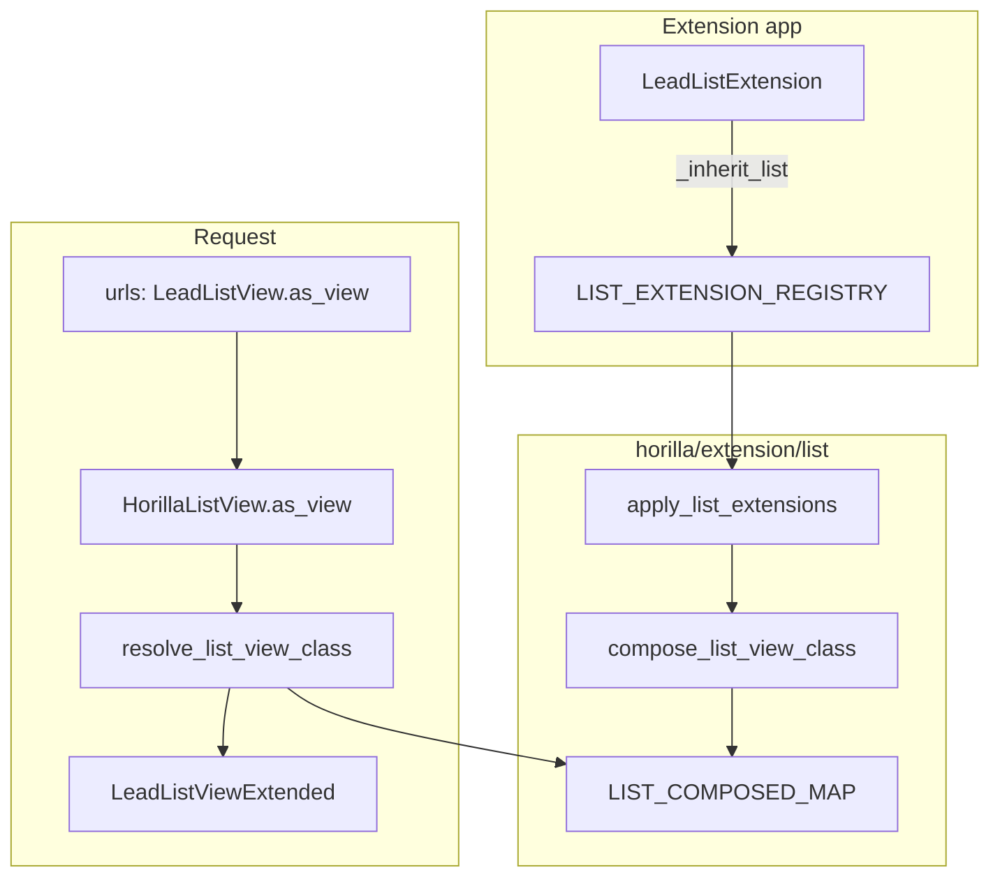

# Horilla `_inherit_list` — List View Extension Guide

> **Status:** Implemented (`horilla/extension/list/`)
> **Related:** [Model `_inherit`](../models/inherit.md) · [Form `_inherit_form`](../forms/inherit.md)
> **CRM example:** `my_lead_extensions/lists.py` · **Core tests:** `horilla/extension/list/tests.py` (`UserListView`)

Extend existing `HorillaListView` subclasses (core `UserListView`, CRM `LeadListView`, etc.) **without** editing target-app view classes or URL names.

---

## Table of contents

1. [Problem](#problem)
2. [Solution overview](#solution-overview)
3. [Quick start](#quick-start)
4. [Rules](#rules)
5. [Layout hooks (class attributes)](#layout-hooks-class-attributes)
6. [Method overrides](#method-overrides)
7. [Composition and MRO](#composition-and-mro)
8. [Bootstrap and platform hooks](#bootstrap-and-platform-hooks)
9. [Package layout](#package-layout)
10. [Comparison with other extension mechanisms](#comparison-with-other-extension-mechanisms)
11. [Non-goals (v1)](#non-goals-v1)
12. [Acceptance criteria](#acceptance-criteria)
13. [Debugging](#debugging)
14. [Full example: Lead list + `industry_code`](#full-example-lead-list--industry_code)

---

## Problem

After model `_inherit` adds a column (e.g. `industry_code` on `leads.Lead`) and `_inherit_form` shows it on create/edit, the **list table** still uses the core view’s hardcoded `columns`:

```python
# horilla_crm/leads/views/core.py — unchanged by model/form extension alone
class LeadListView(LoginRequiredMixin, HorillaListView):
    columns = [
        "title",
        "first_name",
        # ...
        "industry",
        "annual_revenue",
    ]
```

| Approach | Downside |
|----------|----------|
| Edit `horilla_crm/leads/views/core.py` | Lost on upstream merge |
| Subclass `LeadListView` + new URL | Duplicate routes; menus/bookmarks still point at core URL |
| Rely only on column picker | Injected field not in **default** columns; poor UX for admins |

`_inherit_list` closes this gap the same way `_inherit_form` closes the form gap: **registration + composition at startup**, no monkey-patching of core modules.

---

## Solution overview



| Step | What happens |
|------|----------------|
| 1 | Extension app imports `lists.py`; `ListExtension` subclasses register via `__init_subclass__`. |
| 2 | `horilla/urls/project.py` calls `bootstrap_extensions()` → `apply_list_extensions(force=True)` once `django.apps.ready`. |
| 3 | For each target path, platform builds `LeadListViewExtended` (merged attrs + extension mixins). |
| 4 | URLs keep `LeadListView.as_view()`; a wrapper resolves to the composed class **on each HTTP request**. |
| 5 | `__init__` runs on the composed class (column verbose names, optional `setup_list_view_extension`). |

Core CRM files and URL names stay unchanged.

### Why request-time resolution?

`horilla_crm.leads` registers URLs inside `AppLauncher.ready()`, which calls `LeadListView.as_view()` while URLs are wired. Extension apps (e.g. `my_lead_extensions`) often load **after** CRM apps in `INSTALLED_APPS`, so `lists.py` may not be imported yet at URL-registration time. Resolving only inside `as_view()` at import time would permanently bind the unextended view.

**Fix (no `INSTALLED_APPS` reorder required):**

1. **Per-request resolution** — `HorillaListView.as_view()` returns a wrapper that calls `resolve_list_view_class()` on each HTTP request (after all apps have loaded).
2. **Platform bootstrap** — `horilla.urls.project` calls `bootstrap_extensions()` once `django.apps.ready` is true.

Clients only append their app in **their** settings file:

```python
# local_settings.py (client-owned — do not edit horilla_apps.py / base.py)
INSTALLED_APPS += [
    "my_lead_extensions",  # after horilla_crm.* is fine
]
```

| Mechanism | Load order required? |
|-----------|----------------------|
| Model `_inherit` | No — metaclass + migrations in extension app |
| Form `_inherit_form` | No — `get_form_class()` resolves per request |
| List `_inherit_list` | No — request wrapper + platform bootstrap |

---

## Quick start

Pair with model + form extension for `industry_code` on Lead.

```python
# my_lead_extensions/lists.py
from horilla.extension.list import ListExtension


class LeadListExtension(ListExtension):
  _inherit_list = "horilla_crm.leads.views.core.LeadListView"

  columns_insert = [
      ("industry", "industry_code"),
  ]

  bulk_update_fields_append = ["industry_code"]
```

```python
# my_lead_extensions/apps.py
auto_import_modules = ["models", "forms", "lists", "kanbans", "details"]
```

```python
# local_settings.py — client-owned; after horilla_crm.* is fine
INSTALLED_APPS += ["my_lead_extensions"]
```

Restart the dev server after changing list extensions.

---

## Rules

| Topic | Rule |
|-------|------|
| Base class | `ListExtension` (`horilla.extension.list`) — do **not** instantiate |
| `_inherit_list` | `"<module>.<ClassName>"` e.g. `"horilla_crm.leads.views.core.LeadListView"` |
| Naming | Under `horilla/`, use `ListExtension` not `HorillaListExtension` — see [Extension index](../inherit.md#bootstrap) |
| Target | Concrete `HorillaListView` subclass, **not** bare `HorillaListView` |
| Layout | Use `*_insert` / `*_append` hooks — do not patch core `columns` in place |
| Methods | Override `get_queryset`, `get_context_data`, etc. with **`super()`** |
| Per-request tweaks | `setup_list_view_extension()` — not `__init__` on the extension registration class |
| App order | Extension app **after** CRM when possible; per-request `as_view()` wrapper + `bootstrap_extensions()` avoid strict reorder for lists |
| Model fields | Column names must exist on the model (via `_inherit` or core) |
| URLs | Keep using core URL names; resolution happens in `as_view()` |

### `_inherit_list` validation

| Rule | Result |
|------|--------|
| Module import fails | Startup error (`list_extensions.E002`) |
| Class missing | Startup error |
| Not a `django.views.generic.View` subclass | Startup error (`list_extensions.E003`) |
| Invalid path (no dot) | Startup error (`list_extensions.E001`) |

```bash
python manage.py check --tag list_extensions
```

---

## Layout hooks (class attributes)

Extensions declare **deltas**; the composer merges them onto the target class before instances are created.

### Column layout

| Hook | Type | Description |
|------|------|-------------|
| `columns_insert` | `list[tuple[str, str \| tuple]]` | Insert after anchor column: `[("industry", "industry_code"), …]` |
| `columns_append` | `list[str \| tuple]` | Append if not already present |

Column entries match `HorillaListView.columns` conventions:

- **String** — field name; verbose name resolved in `__init__` from model `_meta`.
- **Tuple** — `(verbose_name, field_name)` or custom column id (same as core lists).

```python
columns_insert = [
    ("lead_status", ("Compliance tier", "compliance_tier")),
]
```

**Conflict:** two extensions insert at the same anchor → higher `_inherit_list_priority` wins, then `INSTALLED_APPS` order.

### List append hooks

Each hook appends to the target attribute (union, preserve order, skip duplicates).

| Extension hook | Merged onto target attribute |
|----------------|------------------------------|
| `bulk_update_fields_append` | `bulk_update_fields` |
| `export_exclude_append` | `export_exclude` |
| `exclude_columns_append` | `exclude_columns` |
| `actions_append` | `actions` |
| `custom_bulk_actions_append` | `custom_bulk_actions` |
| `additional_action_button_append` | `additional_action_button` |
| `exclude_quick_filter_fields_append` | `exclude_quick_filter_fields` |
| `exclude_columns_from_sorting_append` | `exclude_columns_from_sorting` |

### Scalar overrides

Set directly on the extension class (last extension by priority wins):

| Attribute | Use |
|-----------|-----|
| `filterset_class` | Point list at extended `FilterSet` |
| `default_sort_field` | Default sort column |
| `default_sort_direction` | `"asc"` / `"desc"` |
| `paginate_by` | Page size |
| `view_id` | List view id (use with care — affects saved column visibility keys) |
| `enable_quick_filters` | Toggle quick filters |
| `bulk_update_option` | Toggle bulk update UI |
| `bulk_export_option` | Toggle export |
| `list_column_visibility` | Toggle column picker |
| `owner_filtration` | Toggle owner scoping |
| `enable_sorting` | Toggle column sorting |

### Not merged in v1 (override via methods or future hooks)

| Target attribute | Reason |
|------------------|--------|
| `col_attrs`, `header_attrs`, `raw_attrs` | HTMX/CSS structures; override `@cached_property` or method with `super()` |
| `template_name`, `main_url`, `search_url` | Routing contract; changing breaks bookmarks |
| `model` | Must stay the extended model class |

---

## Method overrides

Extension contributions become **mixins** in the composed class MRO. Standard Django CBV patterns apply.

```python
class LeadListExtension(ListExtension):
    _inherit_list = "horilla_crm.leads.views.core.LeadListView"

    def get_context_data(self, **kwargs):
        context = super().get_context_data(**kwargs)
        context["show_industry_code_hint"] = True
        return context
```

| Method | Policy |
|--------|--------|
| `get_queryset`, `get_context_data`, `dispatch`, … | Normal MRO; **always** call `super()` unless intentionally replacing behavior |
| `setup_list_view_extension` | Optional; called once per instance from composed view `__init__` |
| `@cached_property` (e.g. `col_attrs`) | Define on extension mixin; overrides target when placed before target in MRO |

Do **not** override `__init__` on `ListExtension` registration classes.

---

## Composition and MRO

Composed class shape:

```text
LeadListViewExtended
  → LeadListExtensionMixin   (extension methods + setup hook)
  → LeadListView             (core CRM)
  → HorillaListViewMixin
  → HorillaListView
  → ListView
```

Markers on composed classes:

```python
__horilla_list_composed__ = True
__horilla_list_path__ = "horilla_crm.leads.views.core.LeadListView"
__wrapped_list_view__ = LeadListView
```

The original `LeadListView` class object is never modified.

### Registry

```python
LIST_EXTENSION_REGISTRY = {
    "horilla_crm.leads.views.core.LeadListView": [ListExtensionSpec(...), ...],
}
```

Optional priority:

```python
_inherit_list_priority = 100  # higher = later in mixin order (wins conflicts)
```

Sort key: `(priority, INSTALLED_APPS order)`.

---

## Bootstrap and platform hooks

List extensions use **three** platform integrations (extension authors do not edit these).

| Hook | Location | Purpose |
|------|----------|---------|
| `bootstrap_extensions()` | `horilla/extension/bootstrap.py` | Compose forms + list + kanban + detail; called from `horilla/urls/project.py` |
| `apply_list_extensions()` | `horilla/extension/list/bootstrap.py` | Build `LIST_COMPOSED_MAP` (registry fingerprint; idempotent) |
| `HorillaListView.as_view()` | `horilla/contrib/generics/views/list.py` | Per-request wrapper → `resolve_list_view_class()` |

`CoreConfig.ready()` may also call `apply_form_extensions()` / `apply_list_extensions()` when `django.apps.ready` is already true; the URLconf `bootstrap_extensions()` call is the reliable path when extension apps load after CRM.

### Startup (`horilla/urls/project.py`)

```python
from horilla.extension.bootstrap import bootstrap_extensions

bootstrap_extensions()
```

### Per-request list resolution (`horilla/contrib/generics/views/list.py`)

`as_view()` returns a wrapper around the core view. On each request it calls `resolve_list_view_class(cls)` and delegates to `LeadListViewExtended.as_view()` when extensions exist. A cached handler is invalidated when `registry_fingerprint()` changes (e.g. dev autoreload).

Composed views (`__horilla_list_composed__`) call `super().as_view()` directly and skip the wrapper.

### When your extension registers

| Mechanism | Registration trigger |
|-----------|----------------------|
| Model `_inherit` | Import `models.py` |
| Form `_inherit_form` | Import `forms.py` |
| List `_inherit_list` | Import `lists.py` (or `list_extensions.py`) via `auto_import_modules` |

### Registration flow

1. `ListExtension` subclass sets `_inherit_list` → `register_list_extension_class()` builds a `ListExtensionSpec` and calls `register_list_extension()`.
2. `register_list_extension()` appends to `LIST_EXTENSION_REGISTRY` and calls `cache.invalidate_after_registry_change()` (does not import `compose`).
3. `metaclass._compose_registered_target()` calls `apply_list_extensions()` when Django apps are ready.

---

## Package layout

```text
horilla/extension/list/
├── __init__.py          # public API
├── cache.py             # RESOLVER_CACHE, LAST_FINGERPRINT (no upstream imports)
├── registry.py          # LIST_EXTENSION_REGISTRY, ListExtensionSpec
├── metaclass.py         # ListExtension, registration
├── merge.py             # columns_insert/append, append attr union
├── compose.py           # compose_list_view_class() (lazy registry import)
├── resolve.py           # resolve_list_view_class()
├── bootstrap.py         # apply_list_extensions()
├── checks.py            # manage.py check --tag list_extensions
├── debug.py             # get_list_extensions(), print_list_view_mro()
└── tests.py
```

Public API (`horilla.extension.list`):

```python
from horilla.extension.list import (
    ListExtension,
    resolve_list_view_class,
    apply_list_extensions,
    get_list_extensions,
    print_list_view_mro,
)
```

---

## Comparison with other extension mechanisms

| | `_inherit` (model) | `_inherit_form` (form) | `_inherit_list` (list) |
|--|-------------------|------------------------|-------------------------|
| Key | `"leads.Lead"` | `"horilla_crm.leads.forms.LeadSingleForm"` | `"horilla_crm.leads.views.core.LeadListView"` |
| Base | `HorillaCoreModel` | `FormExtension` | `ListExtension` |
| Storage | DB + extension migrations | Python only | Python only |
| Core hook | `ExtensionModelBase` | `get_form_class()` → `resolve_form_class()` | `as_view()` wrapper → `resolve_list_view_class()` |
| Startup compose | N/A | `bootstrap_extensions()` | `bootstrap_extensions()` |
| `ready()` on target | No (metaclass) | Per-request + startup | Per-request + startup |
| Odoo analogue | `_inherit` on `models.Model` | Form view / `fields` xpath | Tree view `//field` xpath |

### Full extension app (model + form + list + kanban + detail)

```text
my_lead_extensions/
├── models.py    # _inherit = "leads.Lead"
├── forms.py     # _inherit_form = "...LeadSingleForm"
├── filters.py   # _inherit_filter = "...LeadFilter"
├── navbars.py   # _inherit_nav = "...LeadNavbar"
├── lists.py     # _inherit_list = "...LeadListView"
├── kanbans.py   # _inherit_kanban = "...LeadKanbanView"
├── details.py   # _inherit_detail = "...LeadDetailView"
└── migrations/
```

---

## Non-goals (v1)

- Template / xpath inheritance for `list_view.html`
- DRF `ModelViewSet` / serializer list field extension
- Extending bare `HorillaListView` without a concrete CRM subclass
- Runtime hot-reload (server restart required)
- Filter panel behavior — use [_inherit_filter](../filter/inherit.md) (`exclude_append`, `search_fields_append`; controls `filter_row.html` via `_get_model_fields()`)
- Detail view extension — see [detail/inherit.md](../detail/inherit.md) (`_inherit_detail`, implemented)
- Card view extension (future `_inherit_card`)
- Kanban extension — see [kanban/inherit.md](../kanban/inherit.md) (`_inherit_kanban`, implemented)
- Subviews that set `form_class = None` dynamic lists

---

## Acceptance criteria

- [x] Extension app adds list columns without editing `horilla_crm` views
- [x] Core CRM URLs unchanged (`leads:leads_list` still uses `LeadListView.as_view()`)
- [x] `python manage.py check --tag list_extensions` passes
- [x] Composed view preserves `LeadListView` HTMX `col_attrs` when not overridden
- [x] `bulk_update_fields_append` exposes injected fields in bulk update
- [x] Uninstalling extension app restores original list columns (no composed class in map)
- [ ] Works with `HorillaTimelineView` subclasses of `HorillaListView` when target path points at them
- [x] Documented in extension index next to model and form guides

---

## Debugging

```python
from horilla.extension.list import get_list_extensions, print_list_view_mro

print(get_list_extensions("horilla_crm.leads.views.core.LeadListView"))
print_list_view_mro("horilla_crm.leads.views.core.LeadListView")
```

```bash
python manage.py check --tag list_extensions
```

Inspect composed class:

```python
from horilla.extension.list import resolve_list_view_class
from horilla_crm.leads.views.core import LeadListView

cls = resolve_list_view_class(LeadListView)
print(cls.columns)
print([c.__name__ for c in cls.mro()])
```

---

## Full example: Lead list + `industry_code`

Assumes `LeadExtension` with `industry_code` and form extensions from `my_lead_extensions/forms.py`.

```python
# my_lead_extensions/lists.py
from horilla.extension.list import ListExtension


class LeadListExtension(ListExtension):
    """
    Show industry_code on the main Lead list and allow bulk update.
    """

    _inherit_list = "horilla_crm.leads.views.core.LeadListView"
    _inherit_list_priority = 0

    columns_insert = [
        ("industry", "industry_code"),
    ]

    bulk_update_fields_append = ["industry_code"]

    export_exclude_append = []  # include industry_code in export if desired

    def setup_list_view_extension(self):
        """Optional per-request hook (rare for lists)."""
        pass
```

Filter extension (preferred over subclassing `LeadFilter` or setting `filterset_class` on the list extension):

```python
# my_lead_extensions/filters.py
from horilla.extension.filter import FilterExtension

class LeadFilterExtension(FilterExtension):
    _inherit_filter = "horilla_crm.leads.filters.LeadFilter"
    exclude_append = ["industry_code"]  # hides from filter_row.html field dropdown
    # search_fields_append = ["industry_code"]  # optional: filter panel search box
```

All views using `filterset_class = LeadFilter` pick this up via `get_filterset_class()`. The filter panel **field** `<select>` (`partials/filter_row.html`) uses `Meta.exclude` from the composed filterset — not list `columns`.

Quick filters (navbar) are separate — use `exclude_quick_filter_fields_append = ["industry_code"]` on `LeadListExtension` if needed. See [filter/inherit.md](../filter/inherit.md#how-the-filter-panel-uses-your-filterset).

---

## See also

- [Plan_HORILLA_INHERIT_MIGRATION.md](../../../Plan_HORILLA_INHERIT_MIGRATION.md) — model `_inherit` design
- [forms/inherit.md](../forms/inherit.md) — `_inherit_form` (implemented)
- [filter/inherit.md](../filter/inherit.md) — `_inherit_filter` (implemented)
- [nav/inherit.md](../nav/inherit.md) — `_inherit_nav` (implemented)
- [models/inherit.md](../models/inherit.md) — `_inherit` (implemented)
- [horilla-app-dependencies.md](../../../horilla-app-dependencies.md) — app load order
