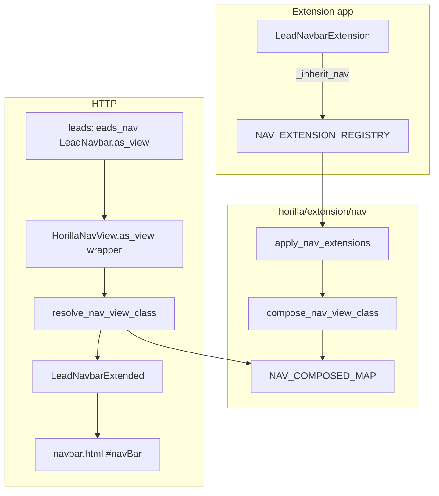

# `_inherit_nav` — Technical specification

> **Status:** Implemented (`horilla/extension/nav/`)
> **User guide:** [inherit.md](./inherit.md)
> **Index:** [../inherit.md](../inherit.md)

---

## 1. Purpose

Extend existing `HorillaNavView` subclasses (e.g. `LeadNavbar`) from extension apps **without** editing `horilla_crm` view modules, using the same registration + composition pattern as `_inherit_list` and `_inherit_detail`.

| Problem | Solution |
|---------|----------|
| Add navbar dropdown actions (Import, Add Column, etc.) | `actions_append` |
| Add view-type filter options | `custom_view_type_update` |
| Hide fields from column selector modal | `column_selector_exclude_fields_append` |
| Extend kanban/group-by exclude field list | `exclude_kanban_fields_append` |
| Toggle navbar flags (`enable_quick_filters`, etc.) | Scalar override on extension class body |
| Override `new_button` / `get_context_data` | Methods on extension class (mixin MRO) |

---

## 2. Registration API

| Attribute | Required | Description |
|-----------|----------|-------------|
| `_inherit_nav` | Yes | Dotted path: `"horilla_crm.leads.views.core.LeadNavbar"` |
| `_inherit_nav_priority` | No | Higher = later mixin (wins conflicts). Default `0`. |
| `override_attrs` | No | Reserved for future scalar conflict rules |

### Layout hooks (class attributes)

| Hook | Behavior |
|------|----------|
| `actions_append` | Append dicts `{"action": str, "attrs": str}` to `actions` (merges with `@cached_property` on target) |
| `custom_view_type_update` | Shallow-merge into `custom_view_type` dict (view-type dropdown in `navbar.html`) |
| `column_selector_exclude_fields_append` | Union append to `column_selector_exclude_fields` |
| `exclude_kanban_fields_append` | Append field names to comma-separated `exclude_kanban_fields` |
| `navbar_indication_attrs_update` | Shallow-merge into `navbar_indication_attrs` |

### Scalar overrides (declare on extension class body)

| Attribute | Example use |
|-----------|-------------|
| `enable_quick_filters` | Turn on quick-filter UI from extension |
| `enable_actions` | Enable Import / layout actions menu |
| `filter_option` | Show filter panel toggle |
| `search_option` | Show search box |
| `default_layout` | Default list/kanban/card layout |
| `filterset_class` | Resolved via `get_filterset_class()` + `_inherit_filter` |
| `nav_width`, `navbar_indication`, `save_to_list_option`, … | See `HorillaNavView` in `navbar.py` |

### Methods

Callable attributes on the extension class body become mixin methods; use `super()` when overriding `get_context_data`, `new_button`, etc.

### Instance hook

`setup_nav_view_extension(self)` — optional no-op on each extension mixin (for future per-request tweaks).

---

## 3. Package layout

```text
horilla/extension/nav/
├── __init__.py
├── registry.py       # NAV_*_REGISTRY, NavExtensionSpec
├── cache.py
├── metaclass.py    # NavExtension
├── merge.py
├── compose.py
├── resolve.py
├── bootstrap.py
├── checks.py       # nav_extensions.E001–E004
├── debug.py
└── tests.py
```

---

## 4. Runtime flow



| Step | Module | Action |
|------|--------|--------|
| 1 | `metaclass.py` | `NavExtension.__init_subclass__` → register spec |
| 2 | `bootstrap.py` | `apply_nav_extensions(force=True)` |
| 3 | `navbar.py` | `as_view()` wrapper calls `resolve_nav_view_class()` per request |
| 4 | `get_context_data()` | Runs on composed class (merged attrs + mixins) |

**Resolution timing:** Per HTTP request via `as_view()` wrapper (same as list/kanban/detail).

---

## 5. Composition rules

| Rule | Detail |
|------|--------|
| MRO | `LeadNavbarExtended` → `ExtNMixin` → … → `LeadNavbar` → … |
| Markers | `__horilla_nav_composed__`, `__horilla_nav_path__`, `__wrapped_nav_view__` |
| `actions` on target | If target uses `@cached_property def actions`, composed class uses a mixin that calls `super().actions` then appends |
| `custom_view_type` on target | Mixin merges `custom_view_type_update`; handles missing base attribute |
| Target unchanged | Core `LeadNavbar` class object never mutated |

---

## 6. Platform integration

| Location | Change |
|----------|--------|
| `horilla/extension/bootstrap.py` | `apply_nav_extensions(force=True)` |
| `horilla/contrib/core/apps.py` | `apply_nav_extensions()` in `ready()` |
| `horilla/contrib/generics/views/navbar.py` | `as_view()` wrapper; `get_filterset_class()` |

### Navbar load path

| Piece | Detail |
|-------|--------|
| Page shell | `base.html` → `#navBar` hx-get `nav_url` (e.g. `leads:leads_nav`) |
| URL | `path("leads-nav/", LeadNavbar.as_view())` — unchanged |
| Template | `navbar.html` reads context from composed `LeadNavbarExtended` |

---

## 7. System checks

```bash
python manage.py check   # nav_extensions.E001–E004 when extension apps are installed
```

| ID | Condition |
|----|-----------|
| `nav_extensions.E001` | Invalid `_inherit_nav` path format |
| `nav_extensions.E002` | Target import failure |
| `nav_extensions.E003` | Target is not a `HorillaNavView` subclass |
| `nav_extensions.E004` | Target is bare `HorillaNavView` (must be concrete subclass) |

---

## 8. Non-goals (v1)

- Editing `navbar.html` from extensions
- Replacing `search_url` / `main_url` / layout URLs via extension (use methods + `reverse_lazy` on extension class if needed)
- Hot-reload without process restart
- Extending bare `HorillaNavView` without a concrete CRM navbar class

---

## 9. Acceptance criteria

- [x] Extension app extends `LeadNavbar` via `_inherit_nav` only
- [x] `leads:leads_nav` URL unchanged; HTMX `#navBar` uses composed class
- [x] `actions_append` and `custom_view_type_update` work with target `@cached_property` hooks
- [x] `column_selector_exclude_fields_append` merges correctly
- [x] `python manage.py test horilla.extension.nav.tests` passes
- [x] Documented in extension index + `my_lead_extensions/navbars.py`

---

## 10. See also

- [inherit.md](./inherit.md) — developer guide
- [filter/inherit.md](../filter/inherit.md) — `filterset_class` on nav + `_inherit_filter`
- [list/inherit.md](../list/inherit.md) — list content area (separate URL from navbar)
